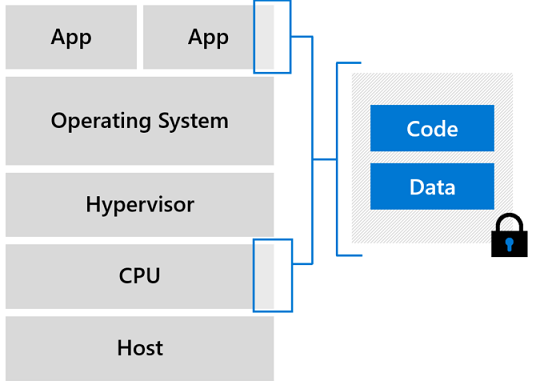

# Confidential Computing Samples

Security is a key driver accelerating the adoption of cloud computing, but it’s also a major concern when you’re moving extremely sensitive IP and data scenarios to the cloud.

Confidential computing is the protection of data-in-use through isolating computations to a hardware-based trusted execution environment (TEE). While data is traditionally encrypted at rest and in transit, confidential computing protects your data while it’s being processed. A TEE provides a protected container by securing a portion of the hardware’s processor and memory. You can run software on top of the protected environment to shield portions of your code and data from view or modification from outside of the TEE. [read more](https://azure.microsoft.com/en-us/solutions/confidential-compute/)

**Scope:** This repo is aggregated samples based for the solutions that are specifically developed to run on Intel SGX hardware (Enclave Aware) and may encompass references to non Azure software and Open Source Solutions (OSS). The deployments are split into VM Compute and Container Compute to Specifically focus on the packaging and deployment preferences.

## Prerequisites

## VM Deployments

[Azure subscription](https://azure.microsoft.com/free/)
[Intel SGX based ACC Virtual Machine (DCSv2)](https://docs.microsoft.com/en-us/azure/confidential-computing/quick-create-portal)
[Azure CLI](https://docs.microsoft.com/en-us/cli/azure/install-azure-cli?view=azure-cli-latest)

## How to use this template repository

This repo is organized by folders that states the sample name followed in the respective packaging and deployment methods.

- [Container Samples](/containersamples/readme.md)
- [VM Samples](/vmsamples/readme.md)

## Contributing

This project welcomes contributions and suggestions.  Most contributions require you to agree to a
Contributor License Agreement (CLA) declaring that you have the right to, and actually do, grant us
the rights to use your contribution. For details, visit <https://cla.opensource.microsoft.com.>

When you submit a pull request, a CLA bot will automatically determine whether you need to provide
a CLA and decorate the PR appropriately (e.g., status check, comment). Simply follow the instructions
provided by the bot. You will only need to do this once across all repos using our CLA.

This project has adopted the [Microsoft Open Source Code of Conduct](https://opensource.microsoft.com/codeofconduct/).
For more information see the [Code of Conduct FAQ](https://opensource.microsoft.com/codeofconduct/faq/) or
contact [opencode@microsoft.com](mailto:opencode@microsoft.com) with any additional questions or comments.
