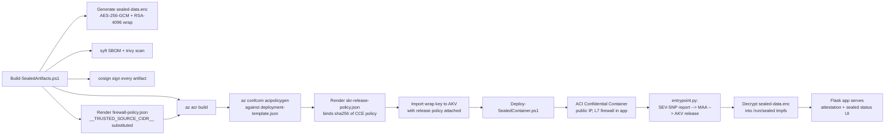

# sealed-container — sealed, attested, signed sample for ACI Confidential Containers

A minimal but production-shaped example of an [Azure Container Instances
Confidential Container][aci-cc] group with **every defensive lever pulled**:

[aci-cc]: https://learn.microsoft.com/azure/container-instances/container-instances-confidential-overview

| Lever                                            | How it's enforced here                                                                                                                                                       |
| ------------------------------------------------ | ---------------------------------------------------------------------------------------------------------------------------------------------------------------------------- |
| Confidential Computing Enforcement (CCE) policy  | Generated by `az confcom acipolicygen` against [deployment-template.json](deployment-template.json) at build time. The platform refuses hand-authored CCE policies, so this is the only form the runtime will load. |
| Signed container image, single pinned digest     | [Dockerfile](Dockerfile) builds with a pinned base digest; ACR push records an immutable `sha256` reference and the CCE policy is bound to that exact digest + layer hashes. |
| Encrypted filesystem inside the container        | [entrypoint.py](entrypoint.py) performs Secure Key Release and unwraps `artifacts/sealed-data.enc` into a tmpfs at `/run/sealed` using AES-256-GCM keyed by an RSA-HSM key.   |
| SKR release policy bound to the CCE policy       | [policies/skr-release-policy.json](policies/skr-release-policy.json) pins `x-ms-sevsnpvm-hostdata` to SHA-256(cce-policy) so the AES key only releases under THIS policy.    |
| Reproducible SBOM with package versions          | [artifacts/sealed-app.sbom.spdx.json](artifacts/sealed-app.sbom.spdx.json) + cyclonedx, regenerated by `Build-SealedArtifacts.ps1` via `syft`.                                |
| Signed vulnerability scan                        | [artifacts/trivy-report.json](artifacts/trivy-report.json) + `.sig`, regenerated via `trivy` and signed with cosign.                                                          |
| Signed policy definitions                        | Every file under `artifacts/` ships with a detached `.sig` and is listed in `artifacts/MANIFEST.json` (itself signed).                                                       |
| Codified, signed L7 firewall (default-deny)      | [policies/firewall-policy.json](policies/firewall-policy.json) is the source of truth; the rendered file is baked into the container image. The CCE policy pins its SHA-256 via the `FIREWALL_POLICY_SHA256` env var, so any tamper between build and run causes the app to refuse to start. The app enforces the policy in a Flask `before_request` hook &mdash; only the trusted source CIDR can reach any route; everything else gets a 403. |
| Checksums verified before every deploy           | `Deploy-SealedContainer.ps1 -Deploy` re-runs `-Verify` first and refuses to deploy on drift.                                                                                |

## Why the firewall is at L7, not L4

Confidential ACI does **not** support attaching a container group to a
VNet/NSG without also adding a NAT Gateway for outbound traffic
([docs][vnet-docs]). That extra resource adds cost, complexity, and a
second public IP that doesn't fit a single-file sample. So this sample
publishes the container on a **public IP** and enforces the same
default-deny ingress rule at the application layer instead. The policy
file is still the source of truth, still signed, and its SHA-256 is
still cryptographically bound to the CCE policy — so a tampered policy
fails the SKR release, exactly the same way a tampered NSG rule chain
would have if the platform allowed it.

[vnet-docs]: https://learn.microsoft.com/azure/container-instances/container-instances-virtual-network-concepts

## Layout

```
sealed-container/
├── README.md                       ← you are here
├── app.py                          ← Flask attestation + sealed-status web app
├── entrypoint.py                   ← PID 1: SKR + unseal, then exec the app
├── Dockerfile                      ← restrictive runtime image, bakes firewall-policy.json
├── requirements.txt
├── templates/
│   └── index.html                  ← single-page visual attestation UI
├── policies/
│   ├── skr-release-policy.json     ← AKV release policy (binds to CCE SHA-256)
│   ├── firewall-policy.json        ← declarative L7 firewall (source of truth)
│   └── README.md
├── deployment-template.json        ← ARM template (Confidential SKU, public IP)
├── Build-SealedArtifacts.ps1       ← build + SBOM + scan + sign + checksum + confcom CCE policy
├── Deploy-SealedContainer.ps1      ← verify + deploy + cleanup
├── artifacts/                      ← signed bundle (generated by Build-SealedArtifacts.ps1)
│   ├── README.md
│   ├── MANIFEST.json (+ .sig)
│   ├── checksums.sha256
│   ├── cce-policy.rego (+ .sig)            ← generated by az confcom acipolicygen
│   ├── skr-release-policy.json (+ .sig)
│   ├── firewall-policy.json (+ .sig)
│   ├── sealed-data.enc (+ .sig)
│   ├── wrap-key.public.pem
│   ├── sealed-app.sbom.spdx.json (+ .sig)
│   ├── sealed-app.sbom.cyclonedx.json (+ .sig)
│   ├── trivy-report.json (+ .sig)
│   ├── trivy-report.summary.md (+ .sig)
│   └── deployment-template.json.sig
└── .gitignore
```

## End-to-end flow



The cryptographic chain that makes this sealed in the strict sense:

1. The ACI control plane sets the SEV-SNP `HOST_DATA` field to
   `sha256(cce-policy)` at `SNP_LAUNCH_FINISH`.
2. The entrypoint asks the AMD Secure Processor for an SNP report and
   posts it to MAA; MAA surfaces `HOST_DATA` as the
   `x-ms-sevsnpvm-hostdata` claim in the signed JWT.
3. The SKR release policy on the AKV wrapping key requires
   `x-ms-sevsnpvm-hostdata == <CCE-policy SHA-256>` exactly. **Edit one
   byte of the policy → hash changes → AKV refuses to release the key →
   the container crash-loops with no plaintext data ever in memory.**

The CCE policy in turn pins:

- The exact image digest + layer hashes (so a re-pushed `latest` is rejected).
- The exact command, working directory, uid/gid (so the entrypoint can't be replaced).
- Every environment variable byte-for-byte, including `TRUSTED_SOURCE_CIDR`
  and `FIREWALL_POLICY_SHA256` — so the app's L7 firewall can't be bypassed
  by re-deploying the same image with different env values.

## Quick start

```powershell
# One-time: build, scan, SBOM, sign, push image, create RG/ACR/KV/identity,
# generate CCE policy with az confcom acipolicygen.
cd aci-samples/sealed-container
./Build-SealedArtifacts.ps1 -Build              # uses prefix sgall by default

# Deploy (re-verifies checksums first; refuses to deploy on drift).
./Deploy-SealedContainer.ps1 -Deploy

# Lock the firewall to a different CIDR (rebuild required — the CIDR is
# baked into the CCE policy via the env var):
./Build-SealedArtifacts.ps1 -Build -TrustedSourceCidr 203.0.113.0/28
./Deploy-SealedContainer.ps1 -Deploy

# Prove that az container exec is blocked:
$cfg = Get-Content acr-config.json | ConvertFrom-Json
$cg  = az container list -g $cfg.resourceGroup --query "[0].name" -o tsv
az container exec -g $cfg.resourceGroup -n $cg --exec-command /bin/sh
# ↑ The ACI control plane will refuse the call; the CCE policy has no exec_processes entries.

# Tear down just the container group:
./Deploy-SealedContainer.ps1 -Cleanup

# Verify the bundle without deploying:
./Deploy-SealedContainer.ps1 -Verify
```

## Prerequisites

Required:

- Azure subscription with quota for Confidential ACI in your chosen region.
- Azure CLI (`az login`) with the **`confcom` extension** installed
  (`az extension add --name confcom`).
- PowerShell 7+ (uses `System.Security.Cryptography.AesGcm`).

Optional but strongly recommended (the build script falls back to clearly
labeled placeholders if any of these are missing):

| Tool                                                                  | Used for                                                  |
| --------------------------------------------------------------------- | --------------------------------------------------------- |
| [syft](https://github.com/anchore/syft)                               | Generating the SPDX + CycloneDX SBOMs.                    |
| [trivy](https://aquasecurity.github.io/trivy/)                        | Container image vulnerability scan.                       |
| [cosign](https://docs.sigstore.dev/cosign/installation/)              | Signing every artifact + the top-level manifest.          |

## What is intentionally NOT here

- **No NSG / VNet integration.** Confidential ACI requires a NAT Gateway
  for outbound traffic in VNet mode; this sample chooses simplicity over
  the extra resource and enforces the same default-deny ingress rule
  inside the app instead. See *Why the firewall is at L7* above.
- **No Standard-SKU deployment.** The SKR release policy refuses to release
  the AES wrapping key off SEV-SNP, so a Standard deploy would crash-loop
  forever and be more confusing than educational. See
  [aci-samples/visual-attestation-demo-v2/](../visual-attestation-demo-v2/)
  for a side-by-side Confidential/Standard comparison without SKR.
- **No hand-authored CCE policy.** The ACI control plane silently rejects
  any CCE policy not produced by `az confcom acipolicygen` — the
  deployment provisions but the container never starts, and ARM hits
  its 30-minute timeout with zero events. We use confcom and document
  the resulting policy under `artifacts/cce-policy.rego`.
- **No interactive endpoints.** No `/exec`, `/eval`, `/debug` routes; no
  templating of user input; no upload route.

## Related samples in this repo

- [`visual-attestation-demo-v2/`](../visual-attestation-demo-v2/) —
  attestation visualization without SKR, with a side-by-side
  Confidential/Standard comparison.
- [`skr-examples/Deploy-SKRExample.ps1`](../../skr-examples/Deploy-SKRExample.ps1) —
  SKR end-to-end on a Confidential VM (not a container).
- [`app-and-postgreSQL-demo/`](../app-and-postgreSQL-demo/) — multi-container
  confidential ACI with PostgreSQL.
