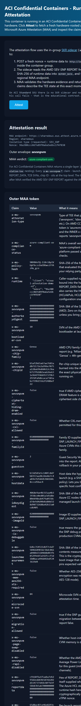
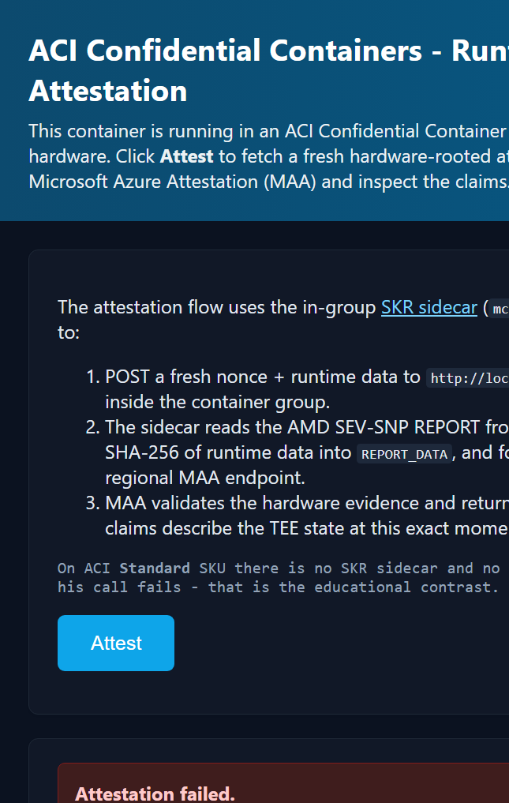

# Visual Attestation Demo v2 on Azure Container Instances

A self-contained ACI port of the AKS confidential-node attestation web UI from
`aks-samples/azure-voting-app/attestation/`. This is the **v2** of the original
[`visual-attestation-demo`](../visual-attestation-demo/) — same goal, simpler
footprint (no Key Vault / SKR / managed identity), and adds a one-shot
`-Compare` mode that deploys both Confidential and Standard SKUs side-by-side.

It demonstrates **runtime guest attestation** of an AMD SEV-SNP TEE via
Microsoft Azure Attestation (MAA), and shows how the **same image fails to
attest** when run on a non-confidential ACI SKU — the educational point of
the sample.

The container image is built **server-side in Azure Container Registry** via
`az acr build`, so you do **not** need a local Docker daemon to ship the image.
You only need Docker for the optional Confidential SKU deploy, where the
`az confcom acipolicygen` extension uses Docker to compute the CCE policy hash.

## What's in here

| File | Purpose |
|------|---------|
| [Dockerfile](Dockerfile) | Slim Flask image (`python:3.11-slim` + Flask + requests). No tpm2-tools or vTPM stack - attestation runs in a sidecar. |
| [app.py](app.py) | Flask app - POSTs to the SKR sidecar at `localhost:8080/attest/maa` and renders MAA claims. |
| [templates/index.html](templates/index.html) | UI with dark mode, claim explanations, single-layer `sevsnpvm` token rendering. |
| [requirements.txt](requirements.txt) | Flask + requests. |
| [deployment-template-confidential.json](deployment-template-confidential.json) | Two-container ACI template (`cc-attest` + `mcr.microsoft.com/aci/skr:2.10` sidecar), `sku=Confidential`, `ccePolicy` filled by `confcom`. |
| [deployment-template-standard.json](deployment-template-standard.json) | Single-container ACI template, `sku=Standard`, no sidecar (attestation fails by design). |
| [Deploy-VisualAttestationV2.ps1](Deploy-VisualAttestationV2.ps1) | One script for `-Build`, `-Deploy`, `-Compare`, `-Cleanup`. |

## Architecture

```
                     Azure subscription
                +---------------------------+
                | <prefix>-<acr>-rg          |
                |                            |
                |  +----------------------+  |
+-----------+   |  | Azure Container      |  |
|           |   |  | Registry (Basic,     |  |
| az acr    +---+->| admin enabled)       |  |
| build .   |   |  |  cc-attest:1.0       |  |
|           |   |  +----------+-----------+  |
+-----------+   |             |              |
                |             v              |
                |  +----------+-----------+  |
                |  | ACI Confidential SKU |  | <- attestation succeeds
                |  | (AMD SEV-SNP, vTPM)  |  |
                |  +----------------------+  |
                |  +----------------------+  |
                |  | ACI Standard SKU      | | <- attestation FAILS
                |  | (no TEE)             |  |
                |  +----------------------+  |
                +---------------------------+
```

## Prerequisites

- Azure CLI logged in: `az login`
- Subscription with quota for **Confidential ACI** (AMD SEV-SNP) in your region.
  `eastus` is the default; `northeurope`, `westeurope`, `southcentralus`,
  `eastus2` also work.
- For confidential deploys only: **Docker Desktop** running locally, plus the
  `confcom` Azure CLI extension. The script auto-installs `confcom` for you.

The sample does **not** require any role assignments
(Microsoft.Authorization/*) - ACR pulls happen via admin user credentials
embedded in `imageRegistryCredentials`.

## Quick start

### 1. Build the image (server-side, ~5 minutes)

```powershell
./Deploy-VisualAttestationV2.ps1 -Build
```

This creates a resource group, an ACR, runs `az acr build` on the Dockerfile in
this directory, and persists the image coordinates to `acr-config.json`.

### 2. Deploy on Confidential SKU (attestation will succeed)

```powershell
./Deploy-VisualAttestationV2.ps1 -Deploy
```

Requires Docker running locally so `confcom` can compute the CCE policy. Opens
the UI in your browser - click **Run Attestation** and you'll get a fully
populated MAA token with `x-ms-attestation-type=sevsnpvm` and
`x-ms-compliance-status=azure-compliant-cvm`.

### 3. Deploy on Standard SKU (attestation will fail)

```powershell
./Deploy-VisualAttestationV2.ps1 -Deploy -NoAcc
```

No Docker required. The same image runs unmodified, but with no SEV-SNP
hardware and no vTPM passthrough, `cvm-attestation-tools` fails to fetch the
hardware report. The `/api/attest` endpoint returns the underlying error
(typically `Failed to query TPM` or `No HCL report found`), and the script
prints the last 25 lines of container logs for inspection.

### 4. Side-by-side comparison

```powershell
./Deploy-VisualAttestationV2.ps1 -Compare
```

Deploys both flavors in the same resource group and opens both URLs. Same
image, same code path, opposite result - the cleanest way to demo why
attestation matters.

### 5. Cleanup

```powershell
./Deploy-VisualAttestationV2.ps1 -Cleanup
```

Confirms by re-typing the resource group name, then deletes everything
(`--no-wait`).

## Demo screenshots

The screenshots below were captured against a live `-Compare` deployment
(`cc-attest-conf-*` and `cc-attest-std-*` running side-by-side in the same
resource group, same image digest) by clicking **Attest** on each instance.

### Confidential SKU - attestation succeeds

The SKR sidecar produces a fresh AMD SEV-SNP report, MAA validates it, and
the page renders the decoded JWT. Notice
`x-ms-attestation-type = sevsnpvm` and
`x-ms-compliance-status = azure-compliant-uvm`, plus the per-chip
`x-ms-sevsnpvm-chipid`, launch measurement, and TCB version - all rooted in
silicon, not in the web app.



### Standard SKU - attestation fails (by design)

Same image, no SKR sidecar, no TEE. The Flask app cannot reach
`http://localhost:8080/attest/maa` and surfaces a "Connection refused" error.
That deterministic failure is the educational contrast - it proves the
success case really did need confidential hardware.



## Why two SKUs?

The point of this sample is **falsifiability**. A demo that only ever shows
attestation succeeding doesn't prove much - the same JSON response could be
mocked by any web server. By running the *exact same image* on a non-TEE host
and watching it fail in a specific, hardware-rooted way (no `/dev/tpmrm0`
device, no SEV-SNP guest report), you demonstrate that:

1. The success case on Confidential SKU really did come from AMD silicon.
2. A relying party that pins `x-ms-attestation-type=sevsnpvm` and a specific
   `x-ms-policy-hash` cannot be spoofed by a Standard-SKU deployment.

## Differences vs. the AKS sample

| Aspect | AKS sample | This sample |
|--------|------------|-------------|
| Bootstrap | ConfigMap mounts source at pod start | Source baked into image at build time |
| Attestation path | App opens `/dev/tpmrm0` directly via cvm-attestation-tools | App POSTs runtime data to in-group **SKR sidecar** (`mcr.microsoft.com/aci/skr`); ACI CC UVM does not expose a vTPM to the workload container |
| Token shape | Nested - outer with `x-ms-isolation-tee.x-ms-runtime` | Single-layer `sevsnpvm` token (claims at top level) |
| Privileges | `privileged: true`, `/dev/tpmrm0` host mount | None (sidecar talks to UVM) |
| Build | `az acr build` | `az acr build` |
| TEE | Per-node SEV-SNP (`Standard_DC2as_v5`) | Per-container-group SEV-SNP (Confidential ACI) |
| Failure demo | Add a non-CC nodepool | `-NoAcc` switch -> Standard SKU (no sidecar, no TEE) |

## Troubleshooting

**`az confcom acipolicygen` complains Docker isn't running**
Start Docker Desktop, or use `-NoAcc` to skip confidential mode.

**Container is `CrashLoopBackOff` on Confidential SKU**
View logs: `az container logs -g <rg> -n <name> --container-name cc-attest`.
The most common cause is that `cvm-attestation-tools` was updated upstream and
broke our import path - check that `/opt/cvm-tools/cvm-attestation` still has
`src/attestation_client.py`.

**HTTP timeout waiting for the container**
First-time pulls of the ~700 MB image can take 2-3 minutes on a cold ACI host.
Re-open the URL after a minute.
