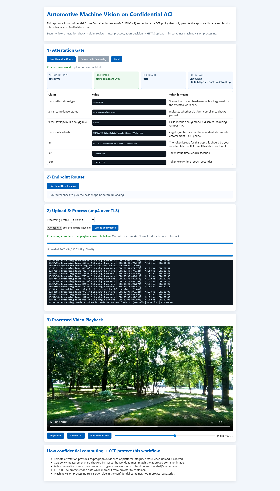

# Automotive Machine Vision (Confidential ACI + CCE)

This is an example of an application protecting data in-use and in-transit (it has no persistent storage), the end user uploads a dashcam video that could contain PII like faces or license plates. The application blurs our all the PII and produces a video you can view in the app minus the PII.

It deploys a Flask-based video redaction app to Azure Container Instances (Confidential SKU), protected by a Confidential Compute Enforcement (CCE) policy and remote attestation gate.

## What the app does

1. Serves the web app over HTTPS.
2. Requires attestation validation before upload/processing can proceed.
3. Accepts `.mp4` uploads and processes video inside the confidential container.
4. Blurs sensitive content in processed output:
   - Faces (cascade detection)
   - License plates (direct plate detection plus vehicle-guided inference and temporal stabilization)
5. Shows processing status with per-worker progress and a final playback view.
6. Exposes live plate-tracking tuning controls in the UI (`holdFrames`, `matchIou`) and applies them without redeploy.

## Live app screenshot

Updated screenshot captured from the running app:



An additional copy is kept at `AutomotiveVisionApp.png` for convenience.

## Current redaction behavior

- Blurs faces and license plates.
- Draws rounded overlays around the primary lead vehicle (cars, trucks), pedestrians, and street signs to make detections legible without obscuring them.
- Uses a lead-vehicle-first strategy: per frame, only the most central, sufficiently large car/truck is selected to anchor plate inference. Tunable via `LEAD_VEHICLE_MIN_AREA_RATIO` (default `0.003`) and `LEAD_VEHICLE_MAX_CENTER_OFFSET` (default `0.42`, fraction of frame width).
- Keeps plate blur stable across short detector dropouts via temporal hold logic.
- Uses red-glare-aware carryover to avoid losing blur under brake-light glare.

## Project files

- `app.py`: Flask API, detection/redaction pipeline, job orchestration, settings APIs.
- `templates/index.html`: web UI for attestation, upload, progress, playback, and plate-tracking settings.
- `Deploy-AutomotiveMachineVision.ps1`: build/deploy script for ACR + confidential ACI deployment.
- `deployment-template.json`: ACI deployment template with CCE policy integration.
- `deployment-params.json`: deployment parameters for the template.
- `Dockerfile`, `nginx.conf`, `supervisord.conf`: runtime container stack.
- `docs/app-screengrab.png`: screenshot embedded in this README.

## Prerequisites

- Azure CLI (`az`)
- Azure CLI `confcom` extension
- PowerShell 7+
- Docker Desktop (required for CCE policy generation)

```powershell
az extension add --name confcom --upgrade
az confcom --version
```

## Build and deploy

```powershell
Set-Location automotive-machine-vision

# Build and push image to ACR
.\Deploy-AutomotiveMachineVision.ps1 -Build

# Deploy confidential ACI with CCE policy generation
.\Deploy-AutomotiveMachineVision.ps1 -Deploy
```

To use a real certificate (including Let's Encrypt), pass your PEM files at deploy time:

```powershell
.\Deploy-AutomotiveMachineVision.ps1 -Deploy \
   -ImageTag amv-20260602-<suffix> \
   -TlsCertPath "C:\path\to\fullchain.pem" \
   -TlsKeyPath "C:\path\to\privkey.pem"
```

For Let's Encrypt specifically, use Certbot output files:

- `fullchain.pem` for `-TlsCertPath`
- `privkey.pem` for `-TlsKeyPath`

### Generate Let's Encrypt artifacts

This repo includes a helper that runs Certbot in Docker and writes local PEM artifacts under `certs/live/<domain>/`:

```powershell
Set-Location automotive-machine-vision

# DNS challenge (manual TXT record entry)
.\Get-LetsEncryptCertificate.ps1 -Domain "your.domain.com" -Email "you@example.com" -Challenge dns-manual

# Optional: HTTP challenge (requires inbound port 80 to this machine)
.\Get-LetsEncryptCertificate.ps1 -Domain "your.domain.com" -Email "you@example.com" -Challenge http-standalone
```

Then deploy using generated files:

```powershell
.\Deploy-AutomotiveMachineVision.ps1 -Deploy \
   -TlsCertPath ".\certs\live\your.domain.com\fullchain.pem" \
   -TlsKeyPath ".\certs\live\your.domain.com\privkey.pem"
```

For deterministic deployments, use an explicit image tag:

```powershell
.\Deploy-AutomotiveMachineVision.ps1 -Build -ImageTag amv-20260602-<suffix>
.\Deploy-AutomotiveMachineVision.ps1 -Deploy -ImageTag amv-20260602-<suffix>
```

### Scaling: vCPUs, memory, and worker count

The deploy script accepts container sizing flags. Defaults are conservative; raise them for higher throughput on larger videos.

| Parameter | Default | Range | Notes |
|---|---|---|---|
| `-CpuCores` | `4` | 1–48 (subscription quota) | Confidential ACI vCPU count |
| `-MemoryInGB` | `6` | up to subscription limit | RAM for the container group |
| `-ProcessingWorkers` | `0` (auto) | 0–30 | Sets `PROCESSING_WORKERS` env var; `0` = `max(6, min(24, CpuCores))` |
| `-DetectEveryNFrames` | `1` | 1–12 | Detector stride; higher = faster, less precise |

The Flask processing pipeline clamps the runtime worker pool at 16 threads regardless of `PROCESSING_WORKERS`, so going above 16 gives diminishing returns. Verify the live worker count via:

```powershell
curl https://<fqdn>/api/debug/runtime?profile=balanced
```

Example 16 vCPU / 16 worker deployment:

```powershell
.\Deploy-AutomotiveMachineVision.ps1 -Deploy -DeployAFD -CpuCores 16 -MemoryInGB 32 -ProcessingWorkers 16
```

> **CCE policy gotcha**: env values in the ARM template must be plain strings, not nested ARM functions like `[string(parameters('x'))]`. `az confcom acipolicygen` does not evaluate nested functions and embeds the literal expression as the env_rules pattern; with `allow_environment_variable_dropping := true` this silently drops the variable at runtime.

### Deploy with Azure Front Door (Microsoft-managed HTTPS)

To simplify HTTPS access and avoid certificate management, deploy the app behind **Azure Front Door** with Microsoft-managed TLS:

```powershell
.\Deploy-AutomotiveMachineVision.ps1 -Deploy -DeployAFD
```

This will:
1. Deploy the confidential ACI container (with self-signed cert fallback).
2. Create an Azure Front Door profile with a Microsoft-managed domain (`*.azurefd.net`).
3. Configure Front Door to route traffic to your ACI FQDN over HTTPS.
4. Return both endpoints:
   - **Front Door (Azure-managed HTTPS)**: `https://amv-endpoint-XXXXX.azurefd.net`
   - **Direct ACI (self-signed)**: `https://amv-XXXXX.eastus.azurecontainer.io`

You can access the app via the Front Door endpoint with automatic HTTPS (no self-signed cert warnings).

> **Why HTTP origin?** AFD forwards HTTPS traffic to the origin over plain HTTP on port 80 (`forwardingProtocol: HttpOnly`). The container's self-signed cert on the ephemeral `*.azurecontainer.io` FQDN can't be trusted by AFD's origin TLS validation, so the edge handles HTTPS termination and the back-channel is HTTP within the Azure backbone. Note: after a redeploy that changes the container FQDN, AFD edge DNS caches can take 5–15 minutes to converge; some PoPs may briefly return 502 with `DNSNameNotResolved`.

**Optional: Bring your own certificate**

If you want to use the direct ACI endpoint with a real CA certificate (e.g., Let's Encrypt), combine both:

```powershell
.\Deploy-AutomotiveMachineVision.ps1 -Deploy \
   -DeployAFD \
   -TlsCertPath ".\certs\live\yourdomain.com\fullchain.pem" \
   -TlsKeyPath ".\certs\live\yourdomain.com\privkey.pem"
```

This gives you both options:
- **Front Door endpoint**: Always available with Microsoft-managed HTTPS.
- **Direct ACI endpoint**: Works with your provided certificate.

## Attestation and policy highlights

- CCE policy generation enforces approved image measurement and non-interactive execution (`--disable-stdio`).
- The UI shows decoded claim values and explanations for attestation evidence before enabling upload.

## Security notes

- The container supports CA-issued certificates (including Let's Encrypt) via `-TlsCertPath` and `-TlsKeyPath`.
- If no certificate is provided, the container falls back to a self-signed certificate for demo/testing.
- Video processing is server-side within the confidential container boundary.
