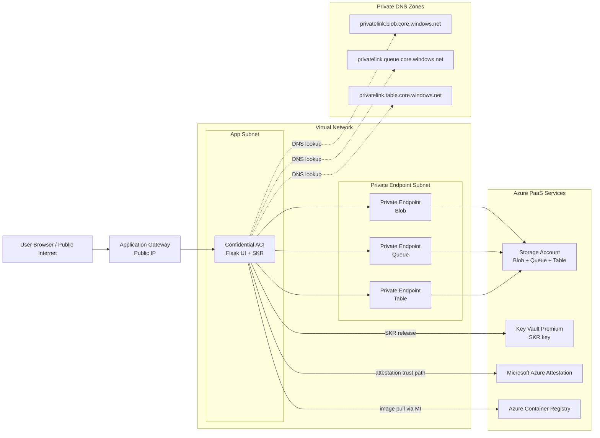

# Storing Confidential Data on Azure Storage Accounts using Client-Side Encryption

This sample creates a confidential Azure Container Instance (ACI) that performs Secure Key Release (SKR) from Azure Key Vault, encrypts data with the released key inside the Trusted Execution Environment (TEE), stores encrypted records in Blob/Table/Queue, and shows encrypted and decrypted results in a web page for comparison.

This is a useful pattern when you need to store sensitive data in a PaaS or SaaS service that does not yet directly support confidential computing. By encrypting the data before it leaves the TEE, the backing service can persist the protected payload without needing access to the plaintext.

The tradeoff is that because the service never sees the decrypted contents, its ability to provide features such as full-text search, indexing, analytics, or other server-side inspection of the data is reduced or unavailable unless you build additional privacy-preserving mechanisms around it.

This example uses ACI to provide the TEE for the encryption/decryption of sensitive data but the same principle applies to other IaaS services in the ACC portfolio (CVMs, AKS Confidential Worker Nodes).

## What this creates

Running the deployment script creates a **new resource group** named:

- `<prefix><5 random letters>`

Inside that resource group it creates:

- User-assigned managed identity
- Azure Container Registry (ACR)
- One Azure Storage account used for Blob, Table, and Queue
- Key Vault Premium with key `customer-secret-key`
- Confidential ACI (AMD SEV-SNP) running the web app + SKR service

All resources are tagged with the signed-in user's UPN.

## Deployment model for secure real-world environments

This sample is designed around a common enterprise pattern where backend data services are private-only and workloads must run inside a Virtual Network.

- Confidential ACI runs in a delegated private subnet.
- Storage account access is via private endpoints (Blob, Queue, Table).
- Private DNS zones resolve storage endpoints to private IPs.
- The managed identity is used for both ACR pull and storage data-plane access.
- Optional public ingress is provided through Application Gateway, which forwards traffic to the private ACI address.

This allows internet users to reach the app through a controlled edge while keeping data plane connectivity private within the VNet.



## Prerequisites

- Azure CLI 2.60+ (`az`)
- Logged in to Azure CLI: `az login`
- Permissions to create resource groups/resources and assign RBAC roles
- One of these active roles at subscription scope: `Owner`, `User Access Administrator`, or `Role Based Access Control Administrator`
- A subscription/region with confidential ACI availability (default: `eastus`)

If your organization uses Microsoft Entra Privileged Identity Management (PIM), activate one of the required role-assignment roles before running the script. The script now checks this up front and exits before creating resources if the required role is not active.

## Deploy

From this folder, run:

```powershell
.\Deploy-ClientSideEncryption.ps1 -Prefix sgall -SecretString "my first secret"
```

Optional parameters:

- `-Location <region>` (default `eastus`)
- `-SubscriptionId <subscription-id>`
- `-SkipBrowser`

## End-to-end flow

1. The script creates resources in a new RG named from `-Prefix` + 5 random letters.
2. The script creates Key Vault key `customer-secret-key` with an SKR release policy.
3. The confidential container starts and exposes a web UI.
4. Click **get secret data**:
- App performs Secure Key Release (`/key/release` via local SKR service).
- App encrypts the original command-line secret.
- App writes encrypted payloads to Blob, Table, and Queue.
- App reads back encrypted data and decrypts it in-memory to display side-by-side.
5. Click **add record** to submit another string from the page:
- App encrypts it with the same released key.
- App stores it in Blob/Table/Queue.
- View updates with the new encrypted and decrypted entries.

## Notes on policy compliance

The script applies secure defaults commonly required by Azure Policy:

- Storage HTTPS only
- Minimum TLS 1.2
- Blob public access disabled
- Managed identity for storage data-plane access
- Managed identity for ACR image pull
- Key Vault Premium for SKR key release support

If your tenant has stricter policy, deployment may require additional controls (private networking, restricted SKUs, approved regions).

## Files

- `Deploy-ClientSideEncryption.ps1` - deploys all Azure resources
- `app.py` - Flask app handling SKR, encryption, and storage operations
- `templates/index.html` - UI with **get secret data** and **add record**
- `deployment-template-original.json` - confidential ACI ARM template (policy injected at deploy time)
- `Dockerfile` - combined app + SKR runtime image
- `supervisord.conf` - starts SKR and Flask in one container
- `requirements.txt` - Python dependencies

## Cleanup

Delete the resource group shown at the end of deployment:

```powershell
az group delete --name <resource-group-name> --yes --no-wait
```

## Further documentation

- Confidential containers on ACI:
https://learn.microsoft.com/azure/container-instances/container-instances-confidential-overview

- Azure CLI `confcom` extension:
https://learn.microsoft.com/cli/azure/confcom

- Secure Key Release with Azure Key Vault:
https://learn.microsoft.com/azure/key-vault/keys/secure-key-release-overview

- Azure Storage data-plane RBAC:
https://learn.microsoft.com/azure/storage/common/storage-auth-aad-rbac-portal

- Microsoft Azure Attestation:
https://learn.microsoft.com/azure/attestation/overview
