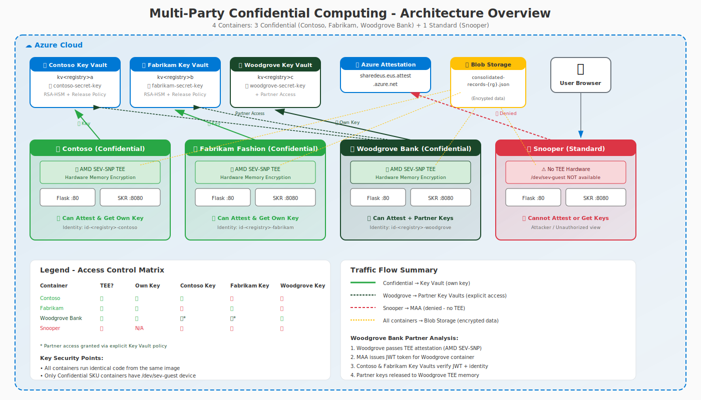
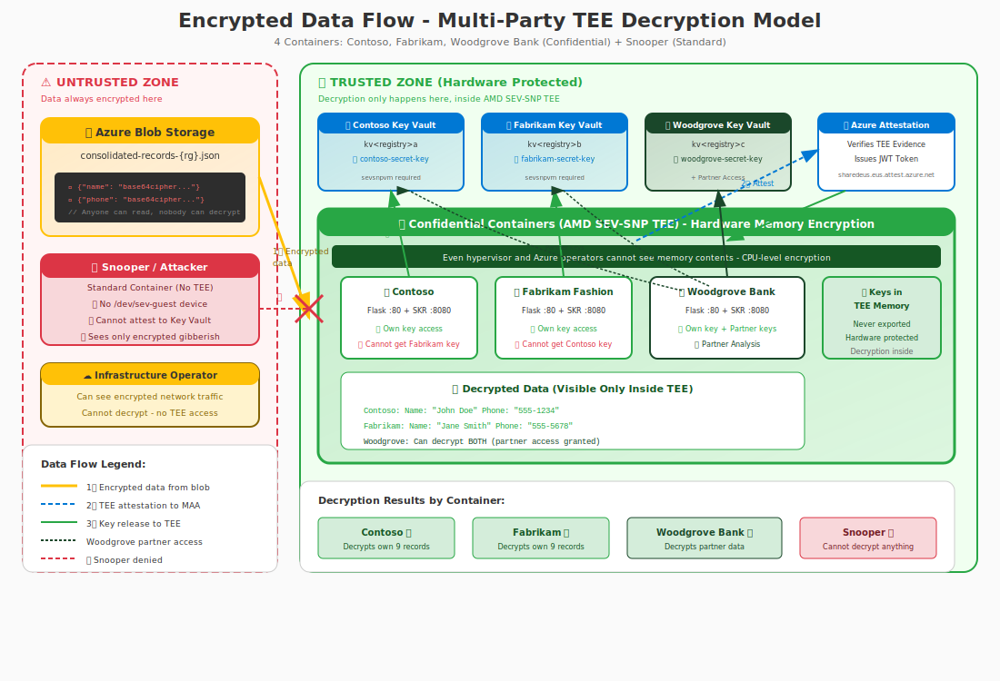

# Multi-Party Samples

Secure multi-party computation demonstrations using Azure Confidential Computing with AMD SEV-SNP hardware protection. Available as both **ACI confidential containers** and **Confidential Virtual Machines (CVMs)**.

## Architecture Overview

```
┌─────────────────────────────────────────────────────────────────────────┐
│                Multi-Party Confidential Computing                         │
├─────────────────────────────────────────────────────────────────────────┤
│                                                                          │
│  ┌───────────────────┐  ┌───────────────────┐  ┌─────────────────────┐   │
│  │  Contoso 🏢        │  │  Fabrikam 👗      │  │  Woodgrove Bank 🏦   │   │
│  │  (Confidential)   │  │  (Confidential)   │  │  (Confidential)      │   │
│  │                   │  │                   │  │  Partner Analytics   │   │
│  │  • Own key only   │  │  • Own key only   │  │  • Own + Partner    │   │
│  │  • Own data       │  │  • Own data       │  │    keys            │   │
│  │  • TEE protected  │  │  • TEE protected  │  │  • Cross-company   │   │
│  └─────────┬─────────┘  └─────────┬─────────┘  └──────────┬──────────┘   │
│            │                    │                     │                  │
│            ▼                    ▼                     ▼                  │
│  ┌────────────────────────────────────────────────────────────────┐   │
│  │                  Azure Blob Storage                                 │   │
│  │               Encrypted Data (consolidated-records-{rg}.json)       │   │
│  │  ┌─────────────────┐  ┌─────────────────┐  ┌───────────────────┐   │   │
│  │  │ Contoso Data    │  │ Fabrikam Data   │  │ Accessible to:    │   │   │
│  │  │ (RSA encrypted) │  │ (RSA encrypted) │  │ • Own container   │   │   │
│  │  │                 │  │                 │  │ • Woodgrove only  │   │   │
│  │  └─────────────────┘  └─────────────────┘  └───────────────────┘   │   │
│  └────────────────────────────────────────────────────────────────┘   │
│                                                                          │
│  ┌───────────────────┐  ┌───────────────────┐  ┌─────────────────────┐   │
│  │  Key Vault A       │  │  Key Vault B      │  │  Key Vault C         │   │
│  │  (Contoso Key)     │  │  (Fabrikam Key)   │  │  (Woodgrove Key)     │   │
│  │  SKR Protected     │  │  SKR Protected    │  │  + Access to A & B  │   │
│  └───────────────────┘  └───────────────────┘  └─────────────────────┘   │
└─────────────────────────────────────────────────────────────────────────┘
```

## 🤖 AI-Generated Content

> **Note:** These multi-party demonstration samples were **entirely created using AI-assisted development** with GitHub Copilot powered by Claude. This showcases the capabilities of modern AI models for developing complex security-focused applications, including:
>
> - Infrastructure-as-code (ARM templates, PowerShell deployment scripts)
> - Cryptographic implementations (AES-256-GCM encryption/decryption)
> - Web applications (Flask backend, interactive HTML/CSS/JavaScript frontend)
> - Security architecture design
> - Documentation and diagrams
>
> **While functional, AI-generated code should always be reviewed by qualified security professionals before use in production scenarios.**

## Available Samples

### [Advanced App](advanced-app/README.md) ⭐ RECOMMENDED

A comprehensive 3-container demonstration with **partner analytics** capabilities:


| Container | Type | Purpose |
|-----------|------|---------|
| **Contoso** | Confidential (AMD SEV-SNP) | Corporate data provider with 800 encrypted employee records (🏢) |
| **Fabrikam Fashion** | Confidential (AMD SEV-SNP) | Online retailer with 800 encrypted customer records (👗) |
| **Woodgrove Bank** | Confidential (AMD SEV-SNP) | Analytics partner with cross-company key access (🏦) |

#### Key Features

- 🔐 **Hardware-Based Security** - AMD SEV-SNP memory encryption at CPU level
- 🛡️ **Remote Attestation** - Cryptographic proof via Microsoft Azure Attestation (MAA)
- 🔑 **Secure Key Release (SKR)** - HSM keys only released to attested TEE containers
- 🏦 **Partner Analytics** - Woodgrove Bank performs cross-company demographic analysis
- 📊 **Real-time Progress** - Server-Sent Events (SSE) streaming with progress bars
- 🌍 **Demographics Analysis** - Top 10 countries with top 3 cities, generations by company, salary world map
- 🔓 **TEE-Only Decryption** - Data decrypted only inside hardware-protected memory
- ☸️ **AKS Virtual Nodes** - Optional `-AKS` deployment on Kubernetes with [virtual nodes](https://learn.microsoft.com/en-us/azure/aks/virtual-nodes), running pods as confidential ACI container groups with full attestation support

#### Architecture



#### Encrypted Data Flow



**Key Insight:** Data remains encrypted in storage and transit. Decryption **only** occurs inside the AMD SEV-SNP TEE, where memory is hardware-encrypted. Even infrastructure operators cannot access plaintext.

#### Quick Start

```powershell
cd advanced-app

# Direct ACI deployment (simpler, recommended for first-time users)
.\Deploy-MultiParty.ps1 -Prefix <yourcode> -Build -Deploy

# AKS Virtual Node deployment (more complex, adds Kubernetes orchestration)
.\Deploy-MultiParty.ps1 -Prefix <yourcode> -Build -Deploy -AKS
```

> **Note:** Replace `<yourcode>` with a short unique identifier (3-8 chars) like your initials or team code. The `-AKS` flag creates an AKS cluster with virtual nodes and deploys pods as confidential ACI container groups. See the [full documentation](advanced-app/README.md#aks-virtual-node-deployment--aks) for AKS architecture details.

See the [full documentation](advanced-app/README.md) for detailed instructions.

---

### [Advanced App — CVM Edition](advanced-app-cvm/README.md) 🛡️ NEW

The same 3-company multi-party demo deployed on **Ubuntu 24.04 Confidential Virtual Machines** (DCas_v5 series) instead of ACI containers:

| VM | Type | Purpose |
|----|------|---------|
| **Contoso** | Confidential VM (AMD SEV-SNP) | Corporate data provider with 800 encrypted employee records (🏢) |
| **Fabrikam Fashion** | Confidential VM (AMD SEV-SNP) | Online retailer with 800 encrypted customer records (👗) |
| **Woodgrove Bank** | Confidential VM (AMD SEV-SNP) | Analytics partner with cross-company key access (🏦) |

#### Key Differences from ACI Version

| Aspect | ACI (`advanced-app/`) | CVM (`advanced-app-cvm/`) |
|--------|----------------------|--------------------------|
| **TEE** | ACI confidential containers | Ubuntu 24.04 CVM (DCas_v5) |
| **Attestation** | ACI SKR sidecar binary | CVM SKR shim via vTPM + guest attestation |
| **Key Binding** | Per-container ccePolicy hash | Per-VM `vmUniqueId` + `azure-compliant-cvm` |
| **Interactive Access** | Blocked by ccePolicy at hardware level | [Compensating controls](advanced-app-cvm/README.md#compensating-controls-for-removing-interactive-access): SSH disabled, NSG deny-all, no Bastion, hidden credentials |
| **Networking** | Per-container public FQDN | Private VNet + Application Gateway WAF_v2 |
| **Disk Encryption** | N/A (ephemeral containers) | Confidential OS disk with customer-managed keys |

#### Quick Start

```powershell
cd advanced-app-cvm

# Standard deployment (all interactive access controls active)
.\Deploy-MultiPartyCVM.ps1 -Prefix <yourcode>

# Debug deployment (SSH + Bastion enabled for troubleshooting)
.\Deploy-MultiPartyCVM.ps1 -Prefix <yourcode> -EnableDebug
```

See the [full documentation](advanced-app-cvm/README.md) for architecture details, compensating controls, and the trust model comparison.

---

### [Demo App](demo-app/README-MultiParty.md)

A simpler 2-container demonstration of two parties storing encrypted data in external, untrusted storage without partner analytics:


| Container | Type | Purpose |
|-----------|------|---------|
| **Contoso** | Confidential (AMD SEV-SNP) | Corporate data provider with access to own encryption key (🏢) |
| **Fabrikam Fashion** | Confidential (AMD SEV-SNP) | Online retailer with access to own encryption key (👗) |

#### Quick Start

```powershell
cd demo-app
.\Deploy-SimpleDemo.ps1 -Prefix <yourcode> -Build -Deploy
```

## Prerequisites

### For ACI Samples (advanced-app, demo-app)

- **Azure CLI** (v2.60+) with `confcom` extension
- **Docker Desktop** - Required for security policy generation
- **Azure subscription** with Confidential Container support
- **PowerShell** 7.0+ recommended (5.1+ minimum)

### For CVM Sample (advanced-app-cvm)

- **Azure PowerShell** (`Az` module) — `Install-Module -Name Az -Force`
- **Azure subscription** with DCas_v5 quota in the target region
- **Contributor** role (or equivalent) on the subscription
- **Logged in** — `Connect-AzAccount`

### Install Azure CLI Extension (ACI only)

```powershell
az extension add --name confcom --upgrade
```

## ⚠️ Disclaimer

This code is provided for **educational and demonstration purposes only**.

- **No Warranty:** Provided "AS IS" without warranty of any kind
- **Not Production-Ready:** Requires thorough review before production use
- **User Responsibility:** Users are responsible for:
  - Security review of all code
  - Compliance with organizational policies
  - Validating cryptographic implementations
  - Proper key management

## Related Resources

- [Azure Confidential Computing](https://azure.microsoft.com/solutions/confidential-compute/)
- [AMD SEV-SNP Technology](https://www.amd.com/en/developer/sev.html)
- [Azure Confidential VMs](https://learn.microsoft.com/azure/confidential-computing/confidential-vm-overview) — DCas_v5 series overview
- [Azure Container Instances - Confidential Containers](https://docs.microsoft.com/azure/container-instances/container-instances-confidential-overview)
- [Microsoft Azure Attestation](https://learn.microsoft.com/azure/attestation/overview)
- [CVM Attestation Tools](https://github.com/Azure/cvm-attestation-tools) — Python-native vTPM attestation library
- [AKS Virtual Nodes](https://learn.microsoft.com/en-us/azure/aks/virtual-nodes) — Virtual node architecture for AKS
- [Virtual Nodes v2 (GitHub)](https://github.com/microsoft/virtualnodesOnAzureContainerInstances) — VN2 Helm chart
