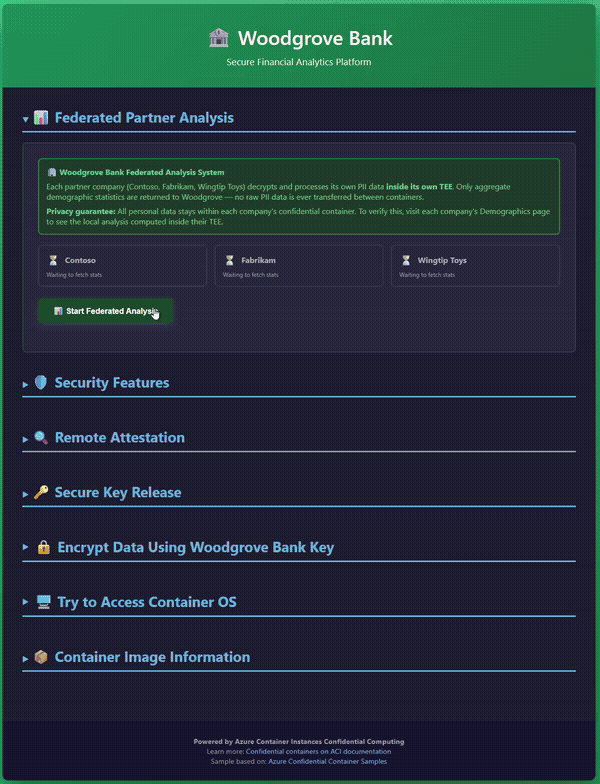
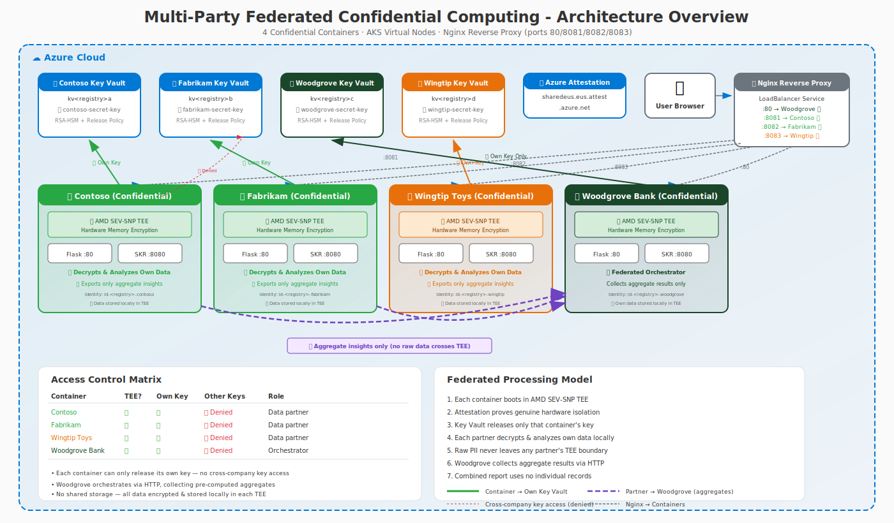
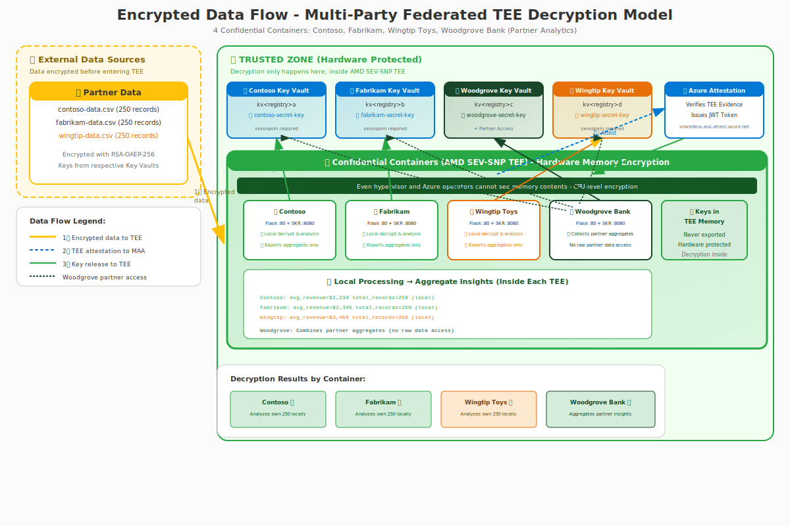

# Federated Multi-Party Confidential Computing Demo

**Author:** Simon Gallagher, Senior Technical Program Manager, Azure Compute Security  
**Last Updated:** May 2026

## 🤖 AI-Generated Content

> **Note:** This entire multi-party demonstration was **created using AI-assisted development** with GitHub Copilot powered by Claude. This showcases the capabilities of modern AI models for developing complex security-focused applications. While functional, AI-generated code should always be reviewed by qualified security professionals before use in production scenarios.

A demonstration of **federated privacy-preserving analytics** using Azure Confidential Container Instances (ACI) with AMD SEV-SNP hardware protection. Each company processes its own sensitive data locally inside a Trusted Execution Environment (TEE) and shares only aggregate statistics — **no PII ever leaves any company's boundary**.

## Demo Recording



## High-Level Topology


## Overview

This project deploys **four containers** running identical code to demonstrate multi-party federated confidential computing:

| Container | SKU | Hardware | Can Attest? | Can Release Keys? | Special Features |
|-----------|-----|----------|-------------|-------------------|------------------|
| **Contoso** | Confidential | AMD SEV-SNP TEE | ✅ Yes | ✅ Own key only | Corporate data provider — local analysis (🏢) |
| **Fabrikam** | Confidential | AMD SEV-SNP TEE | ✅ Yes | ✅ Own key only | Fashion retailer — local analysis (👗) |
| **Wingtip Toys** | Confidential | AMD SEV-SNP TEE | ✅ Yes | ✅ Own key only | Toy manufacturer — local analysis (🧸) |
| **Woodgrove Bank** | Confidential | AMD SEV-SNP TEE | ✅ Yes | ✅ Own + Partner keys | Orchestrator — collects aggregates only (🏦) |

### Key Features

- **Federated Local Processing** - Each company decrypts and analyzes data inside its own TEE; only aggregates leave the boundary
- **Zero PII Transfer** - No names, SSNs, credit cards, medical data, or any personal information is ever transmitted between containers
- **18 Sensitive PII Fields** - Each company holds 250 employee records with highly sensitive data (SSN, credit card, passport, medical conditions, etc.)
- **Multi-Party Isolation** - Each company has separate Key Vault keys bound to their container identity
- **Hardware-Based Security** - AMD SEV-SNP memory encryption at the CPU level
- **Remote Attestation** - Cryptographic proof via Microsoft Azure Attestation (MAA)
- **Secure Key Release (SKR)** - Keys only released to attested confidential containers
- **Cross-Company Protection** - Contoso cannot access Fabrikam's key, and vice versa
- **Signed Results** - Each partner signs their aggregate output with a TEE-attested key for tamper detection
- **Real-time Progress** - SSE streaming with progress bars and time estimates
- **Demographics Analysis** - Combined workforce analytics: generations, salaries, blood types, medical conditions, geography
- **Scrollable Proof Table** - Side-by-side comparison of exactly what each partner sent (aggregates only)
- **Interactive Web UI** - Real-time demonstration of attestation, encryption, and federated analysis

## Architecture



The demo deploys:
- **4 Confidential Containers** (Contoso, Fabrikam, Wingtip Toys, Woodgrove Bank) - Running on AMD SEV-SNP hardware with TEE protection
- **4 Key Vaults** - Separate Premium HSM-backed vaults for each company's encryption keys
- **Shared Blob Storage** - Contains encrypted data from all parties

> **Deployment Modes:** By default, containers deploy directly to ACI. With the `-AKS` parameter, containers deploy as pods on AKS virtual nodes that run as ACI container groups — providing Kubernetes orchestration while preserving the full ACI attestation stack. See [AKS Virtual Node Deployment](#aks-virtual-node-deployment--aks) for details.

> **📄 Security Policy Deep Dive:** See [SECURITY-POLICY.md](SECURITY-POLICY.md) for an annotated example of the Confidential Computing Enforcement Policy (ccePolicy) that cryptographically binds each container's identity.

## Encrypted Data Flow



### How the Federated Model Works

1. **Encrypted Data at Rest** - Each company's employee data (18 PII fields) is encrypted with their own key and stored locally
2. **Attestation First** - Before decryption, each container proves it's running in a genuine AMD SEV-SNP TEE
3. **Key Release** - Azure Key Vault only releases the decryption key after verifying the attestation JWT
4. **Local Analysis Inside TEE** - Each company decrypts its own data and computes aggregate statistics (counts, averages, distributions) inside the TEE
5. **Aggregate-Only Sharing** - Only statistical summaries leave the TEE boundary — no names, IDs, addresses, or any PII
6. **Signed Results** - Each partner signs their aggregates with a TEE-attested key for integrity verification
7. **Woodgrove Combines** - The orchestrator collects signed aggregates from all partners and produces a unified view

### Sensitive Fields Per Company (18 fields, 250 records each)

| Field | Classification | Shared Outside TEE? |
|-------|---------------|---------------------|
| `name` | PII | ❌ Never |
| `email` | PII | ❌ Never |
| `phone` | PII | ❌ Never |
| `date_of_birth` | PII | ❌ Never |
| `national_id` (SSN) | PII - Critical | ❌ Never |
| `salary` | PII - Financial | ❌ Never (only avg/min/max) |
| `credit_card` | PII - Critical | ❌ Never |
| `bank_account` | PII - Financial | ❌ Never |
| `passport_number` | PII - Critical | ❌ Never |
| `medical_condition` | PHI | ❌ Never (only condition counts) |
| `blood_type` | PHI | ❌ Never (only type distribution) |
| `address` | PII | ❌ Never |
| `postal_code` | PII | ❌ Never |
| `city` | PII - Location | ❌ Never (only city counts) |
| `country` | PII - Location | ❌ Never (only country counts) |
| `age` | PII | ❌ Never (only generation buckets) |
| `eye_color` | Personal | ❌ Never (only color distribution) |
| `favorite_color` | Personal | ❌ Never (only color distribution) |

### Woodgrove Bank Federated Orchestration

Woodgrove Bank demonstrates **federated analytics without data access**:
- Requests each partner to run analysis locally inside their own TEE
- Receives only signed aggregate statistics (counts, averages, distributions)
- Verifies result integrity via checksums and TEE-attested signatures
- Combines aggregates into unified workforce analytics dashboard
- **Never decrypts or sees any partner's raw employee data**

### Why Attackers Cannot Decrypt

| Attack Vector | Protection |
|--------------|------------|
| **Compromise Storage** | Data is encrypted; no key available outside TEE |
| **Compromise Network** | TLS + encrypted payloads; key never transmitted |
| **Compromise Container** | Standard containers cannot attest; no key release |
| **Compromise Hypervisor** | SEV-SNP encrypts memory at CPU level |
| **Infrastructure Operator** | Cannot read TEE memory; attestation blocks access |

## Prerequisites

- **Azure CLI** (v2.60+) - [Install Azure CLI](https://docs.microsoft.com/en-us/cli/azure/install-azure-cli)
- **Azure Subscription** - With permissions to create Container Instances, Container Registry, and Key Vault
- **Docker Desktop** - [Download Docker Desktop](https://www.docker.com/products/docker-desktop/) (required for confidential container policy generation)
- **PowerShell** - Version 7.0+ recommended ([PowerShell 7+ download](https://learn.microsoft.com/en-us/powershell/scripting/install/installing-powershell))

#### Additional Prerequisites for AKS Virtual Node Deployment (`-AKS`)

When using the `-AKS` parameter, the following additional tools are required:

- **kubectl** - Kubernetes CLI ([Install via `az aks install-cli`](https://learn.microsoft.com/cli/azure/aks#az-aks-install-cli))
- **Helm** - Kubernetes package manager ([Install Helm](https://helm.sh/docs/intro/install/))
- **Git** - Required to clone the virtual nodes Helm chart repository

### Azure CLI Extensions

```powershell
# Install or update the confcom extension (required for security policy generation)
az extension add --name confcom --upgrade

# Verify installation
az confcom --version
```

## Quick Start

### Step 1: Build the Container Image

```powershell
.\Deploy-MultiParty.ps1 -Prefix <yourcode> -Build
```

> **Prefix**: Use a short, unique identifier (3-8 chars) like your initials (`jd01`), team code (`team42`), or project name (`demo`). This helps identify resource ownership in shared subscriptions.

This creates:
- **Azure Resource Group** - Named `<prefix><registryname>-rg` (default: East US)
- **Azure Container Registry (ACR)** - Basic SKU with admin enabled
- **Contoso Key Vault** - Premium HSM with `contoso-secret-key`
- **Fabrikam Key Vault** - Premium HSM with `fabrikam-secret-key`
- **Wingtip Toys Key Vault** - Premium HSM with `wingtip-secret-key`
- **Woodgrove Bank Key Vault** - Premium HSM with `woodgrove-secret-key`
- **Managed Identities** - Separate identity for each company's container
- **Cross-Company Access** - Woodgrove granted access to Contoso, Fabrikam, and Wingtip Key Vaults
- **Container Image** - Built and pushed to ACR

### Step 2: Deploy All Containers

```powershell
.\Deploy-MultiParty.ps1 -Prefix <yourcode> -Deploy
```

Deploys four containers:
- **Contoso** - Confidential SKU with AMD SEV-SNP TEE (corporate data provider)
- **Fabrikam** - Confidential SKU with AMD SEV-SNP TEE (online retailer)
- **Wingtip Toys** - Confidential SKU with AMD SEV-SNP TEE (toy manufacturer)
- **Woodgrove Bank** - Confidential SKU with AMD SEV-SNP TEE and partner access (analytics partner)

> ⚠️ **Requires Docker to be running** for security policy generation.

### Combined Build and Deploy

```powershell
.\Deploy-MultiParty.ps1 -Prefix <yourcode> -Build -Deploy
```

### Cleanup All Resources

```powershell
.\Deploy-MultiParty.ps1 -Prefix <yourcode> -Cleanup
```

---

## AKS Virtual Node Deployment (`-AKS`)

> **This is a significantly more complex deployment path** compared to direct ACI. Use `-AKS` when you need Kubernetes orchestration while retaining the full ACI confidential computing attestation stack (AMD SEV-SNP TEE + SKR + MAA).

### Why AKS with Virtual Nodes?

The `-AKS` parameter deploys containers as **AKS pods that run on [virtual nodes](https://learn.microsoft.com/en-us/azure/aks/virtual-nodes)**, which transparently schedule workloads as Azure Container Instance (ACI) container groups. This provides:

- **Kubernetes orchestration** — Use `kubectl` to manage pods, view logs, and control the lifecycle
- **Full ACI attestation** — Pods run as confidential ACI container groups with AMD SEV-SNP hardware protection
- **Same security model** — Secure Key Release, MAA attestation, and hardware-based isolation are identical to the direct ACI path
- **Private networking** — Pods communicate over a private VNet (no public FQDNs); external access is via an nginx reverse proxy with a LoadBalancer IP

### AKS Quick Start

```powershell
# Full pipeline: build image + create AKS cluster + deploy pods
.\Deploy-MultiParty.ps1 -Prefix <yourcode> -Build -Deploy -AKS
```

Or in separate steps:

```powershell
# Step 1: Build image, create ACR, Key Vaults (same as direct ACI)
.\Deploy-MultiParty.ps1 -Prefix <yourcode> -Build -AKS

# Step 2: Deploy pods on virtual nodes
.\Deploy-MultiParty.ps1 -Prefix <yourcode> -Deploy -AKS
```

### AKS Architecture

The `-AKS` build phase (`-Build -AKS`) creates a 9-step infrastructure on top of the base build:

```
┌──────────────────────────────────────────────────────────────────────┐
│                        Resource Group                                 │
│  ┌────────────────────────────────────┐                              │
│  │  VNet (10.0.0.0/8)                 │                              │
│  │  ├─ AKS Subnet (10.1.0.0/16)      │  ← Node pool (2x D4s_v4)    │
│  │  └─ ACI Subnet (10.2.0.0/16)      │  ← Placeholder (addon)      │
│  └────────────────────────────────────┘                              │
│                    │ VNet Peering                                     │
│  ┌────────────────────────────────────┐                              │
│  │  MC_ Resource Group                │  (AKS-managed)               │
│  │  ├─ MC VNet (172.16.0.0/16)       │                              │
│  │  │  └─ ACI Subnet (delegated)     │  ← Pods run here             │
│  │  ├─ NAT Gateway                    │  ← Outbound for ACI pods    │
│  │  ├─ Managed Identities (×3)       │  ← Contoso/Fabrikam/Woodgrove│
│  │  └─ aciconnectorlinux identity    │  ← VN2 uses this identity    │
│  └────────────────────────────────────┘                              │
│                                                                       │
│  AKS Cluster: <prefix>-aks-vnodes                                     │
│  ├─ 2 system nodes (Standard_D4s_v4)                                 │
│  ├─ VN2 StatefulSet (vn2 namespace)   ← Virtual kubelet              │
│  ├─ virtualnode2-0 (registered node)  ← Schedules pods as ACI CGs   │
│  └─ nginx-proxy (LoadBalancer)        ← External access              │
│     ├─ :80   → Woodgrove (172.16.x.x)                               │
│     ├─ :8081 → Contoso  (172.16.x.x)                                │
│     └─ :8082 → Fabrikam (172.16.x.x)                                │
└──────────────────────────────────────────────────────────────────────┘
```

#### Key Concepts

1. **Virtual Nodes v2 (VN2)** — A [virtual kubelet](https://virtual-kubelet.io/) implementation from [microsoft/virtualnodesOnAzureContainerInstances](https://github.com/microsoft/virtualnodesOnAzureContainerInstances) that registers as a Kubernetes node. Pods with `nodeSelector: virtualization: virtualnode2` are scheduled onto this virtual node, which creates them as ACI container groups.

2. **aciconnectorlinux identity** — Created automatically by the AKS RP when the `virtual-node` addon is enabled. This managed identity has Contributor on the MC_ resource group, allowing VN2 to create ACI container groups there. The legacy addon is disabled after identity capture; only the identity and its role assignments persist.

3. **MC_ Resource Group networking** — A separate VNet (`172.16.0.0/16`) is created in the MC_ resource group with a delegated ACI subnet and NAT gateway. This VNet is peered with the main VNet so ACI pods can communicate with AKS system pods.

4. **5-Phase Deploy** — The deploy phase is more complex than direct ACI because pod IPs are needed for inter-container routing:
   - **Phase 1:** Generate Contoso/Fabrikam pod YAMLs + confcom security policies
   - **Phase 2:** Deploy Contoso/Fabrikam pods, wait for Running, capture pod IPs
   - **Phase 3:** Generate Woodgrove YAML with partner pod IP URLs + confcom policy
   - **Phase 4:** Create all 3 HSM keys with multi-party release policies
   - **Phase 5:** Deploy Woodgrove pod + nginx reverse proxy with LoadBalancer

5. **Nginx reverse proxy** — Virtual node pods are on a private subnet with no public FQDNs. An nginx deployment on a real AKS node with a LoadBalancer service exposes all four containers:

   | Port | Container | Description |
   |------|-----------|-------------|
   | `:80` | **Woodgrove Bank** 🏦 | Analytics partner (default) |
   | `:8081` | **Contoso** 🏢 | Corporate data provider |
   | `:8082` | **Fabrikam** 👗 | Online retailer |
   | `:8083` | **Wingtip Toys** 🧸 | Toy manufacturer |

   After deployment, access `http://<EXTERNAL-IP>` for Woodgrove, `http://<EXTERNAL-IP>:8081` for Contoso, `http://<EXTERNAL-IP>:8082` for Fabrikam, and `http://<EXTERNAL-IP>:8083` for Wingtip.

#### Pod YAML and confcom

In AKS mode, confcom uses `az confcom acipolicygen --virtual-node-yaml` instead of ARM template-based policy generation. The security policy is injected as a pod annotation (`microsoft.containerinstance.virtualnode.ccepolicy`) and the SHA256 hash is used for key release policy binding — identical to the direct ACI flow.

### Further Reading (Microsoft Documentation)

- [Virtual nodes in AKS](https://learn.microsoft.com/en-us/azure/aks/virtual-nodes) — Overview of virtual node concepts
- [Create and configure an AKS cluster to use virtual nodes (CLI)](https://learn.microsoft.com/en-us/azure/aks/virtual-nodes-cli) — Step-by-step CLI guide
- [Confidential containers on ACI](https://learn.microsoft.com/en-us/azure/container-instances/container-instances-confidential-overview) — AMD SEV-SNP on ACI
- [Confidential containers on AKS](https://learn.microsoft.com/en-us/azure/aks/confidential-containers-overview) — AKS confidential computing overview
- [Virtual Nodes v2 Helm chart (GitHub)](https://github.com/microsoft/virtualnodesOnAzureContainerInstances) — The VN2 source repository

## Command Reference

| Parameter | Description |
|-----------|-------------|
| `-Prefix <code>` | **REQUIRED.** Short unique identifier (3-8 chars, e.g., `jd01`, `dev`, `team42`) |
| `-Build` | Build and push container image to ACR (creates RG, ACR, Key Vaults) |
| `-Deploy` | Deploy all 4 containers (Contoso, Fabrikam, Wingtip Toys, Woodgrove Bank) |
| `-AKS` | Deploy to AKS with confidential virtual nodes instead of direct ACI. See [AKS Virtual Node Deployment](#aks-virtual-node-deployment--aks) |
| `-Cleanup` | Delete all Azure resources in the resource group |
| `-SkipBrowser` | Don't open Microsoft Edge browser after deployment |
| `-RegistryName <name>` | Custom ACR name (default: random 8-character string) |
| `-Location <region>` | Azure region to deploy into (default: `eastus`). MAA endpoint is auto-resolved for the region. |
| `-Description <text>` | Optional description tag for the resource group |

**Note:** Run the script without parameters to see usage help and current configuration.

### Examples

```powershell
# Show help and current configuration
.\Deploy-MultiParty.ps1

# Build with your initials as prefix
.\Deploy-MultiParty.ps1 -Prefix jd01 -Build

# Build with custom registry name
.\Deploy-MultiParty.ps1 -Prefix dev -Build -RegistryName "myregistry"

# Deploy and skip browser
.\Deploy-MultiParty.ps1 -Prefix team42 -Deploy -SkipBrowser

# Full workflow: build and deploy
.\Deploy-MultiParty.ps1 -Prefix acme -Build -Deploy

# Delete all resources
.\Deploy-MultiParty.ps1 -Prefix acme -Cleanup

# --- AKS Virtual Node Examples ---

# Full AKS pipeline: build + create cluster + deploy pods
.\Deploy-MultiParty.ps1 -Prefix jd01 -Build -Deploy -AKS

# Build image + create AKS cluster (no deploy yet)
.\Deploy-MultiParty.ps1 -Prefix dev -Build -AKS

# Deploy pods to an existing AKS cluster
.\Deploy-MultiParty.ps1 -Prefix dev -Deploy -AKS
```

## What You'll See

After deployment, a browser opens with a 3-pane side-by-side comparison view:

```
+------------------+------------------+------------------+------------------+
|     CONTOSO      |    FABRIKAM      |  WINGTIP TOYS    |  WOODGROVE BANK  |
| (Confidential)   | (Confidential)   | (Confidential)   | (Confidential)   |
|       🏢         |       👗         |       🧸         |       🏦         |
| ✅ Attestation   | ✅ Attestation   | ✅ Attestation   | ✅ Attestation   |
| ✅ Key Release   | ✅ Key Release   | ✅ Key Release   | ✅ Key Release   |
| ✅ Encryption    | ✅ Encryption    | ✅ Encryption    | ✅ Partner Keys  |
| ✅ Own data      | ✅ Own data      | ✅ Own data      | ✅ Federated     |
+------------------+------------------+------------------+------------------+
```

### AKS Browser Access

In AKS mode, get the nginx proxy external IP and open each container:

```powershell
kubectl get svc nginx-proxy
# NAME          TYPE           EXTERNAL-IP   PORT(S)
# nginx-proxy   LoadBalancer   <IP>          80,8081,8082
```

| Container | URL |
|-----------|-----|
| **Woodgrove Bank** 🏦 | `http://<EXTERNAL-IP>` |
| **Contoso** 🏢 | `http://<EXTERNAL-IP>:8081` |
| **Fabrikam** 👗 | `http://<EXTERNAL-IP>:8082` |
| **Wingtip Toys** 🧸 | `http://<EXTERNAL-IP>:8083` |

> In direct ACI mode, each container has its own public FQDN shown at deploy time.

### Woodgrove Bank Special Features

- **Custom branding** - Green bank theme with 🏦 logo
- **Partner Analysis System** - Dedicated section for cross-company key release
- **Progress tracking** - Visual indicators for Contoso, Fabrikam, and Wingtip key release
- **Analysis log** - Real-time log of partner key release operations

## Demo Script

See **[DEMO-SCRIPT.md](DEMO-SCRIPT.md)** for a focused 3-minute walkthrough of the federated analysis workflow.

### Basic Attestation Demo

1. **Show Contoso**: Expand "Remote Attestation" → Click "Request Attestation Token" → Success
2. **Explain Claims**: Click "📖 Detailed Explanation of Each Claim" → Walk through categories (JWT Standard, Platform Identity, Hardware Identity, Security State, etc.) showing what each claim proves
3. **Highlight Key Claims**: Point out `x-ms-sevsnpvm-hostdata` (security policy hash), `x-ms-sevsnpvm-is-debuggable: false`, and `x-ms-attestation-type: sevsnpvm`
4. **Show Fabrikam**: Same actions → Also succeeds (pink fashion theme)
5. **Show Wingtip Toys**: Same actions → Also succeeds (coral toy theme)
6. **Show Woodgrove Bank**: Same actions → Also succeeds (green bank theme)

### Container Access Test Demo

7. **Test Container Access**: On any container, expand "Try to Access Container OS" → Click "Attempt to Connect"
8. **Review Results**: All four tests show 🛡️ BLOCKED — SSH refused, exec blocked, stdio denied, privilege escalation prevented
9. **Explain Policy Binding**: Show how `exec_processes: []` and `allow_stdio_access: false` in the ccePolicy prevent even the cloud operator from accessing the container OS

### Secure Key Release Demo

10. **Release Key on Contoso**: Expand "Secure Key Release" → Click release → Key obtained
11. **Cross-Company Test**: On Contoso, expand "Cross-Company Key Access" → Shows cannot access Fabrikam's key

### Partner Analysis Demo (Woodgrove Bank)

12. **Open Woodgrove Bank**: Notice custom green bank branding with 🏦 logo
13. **Expand "Partner Demographic Analysis"**: Click "Start Partner Demographic Analysis"
14. **Watch Progress**: Contoso key release ✅, Fabrikam key release ✅, Wingtip key release ✅
15. **Review Results**: Demographics by country, generation breakdown by company, salary world map
16. **Review Log**: Shows attestation passed for each partner

### Federated Analysis Demo (Woodgrove Bank)

17. **Expand "Federated Analysis"**: Click "Start Federated Analysis"
18. **Watch Collection**: Woodgrove polls each partner for pre-computed analysis results
19. **Review Combined Results**: Aggregated analysis across all four companies
20. **Explain Architecture**: Each partner pre-computes analysis inside their own TEE; Woodgrove collects and aggregates results without accessing raw data

## Security Model

### Per-Company Key Vault Keys

Each company has a separate Key Vault with an SKR-protected key:

```
Contoso Key Vault: kv<registry>a
├── Key: contoso-secret-key (RSA-HSM, exportable)
└── Release Policy: sevsnpvm attestation required

Fabrikam Key Vault: kv<registry>b  
├── Key: fabrikam-secret-key (RSA-HSM, exportable)
└── Release Policy: sevsnpvm attestation required

Woodgrove Bank Key Vault: kv<registry>c
├── Key: woodgrove-secret-key (RSA-HSM, exportable)
├── Release Policy: sevsnpvm attestation required
└── Cross-Company Access: Can also release Contoso, Fabrikam, and Wingtip keys

Wingtip Toys Key Vault: kv<registry>d
├── Key: wingtip-secret-key (RSA-HSM, exportable)
└── Release Policy: sevsnpvm attestation required
```

### Woodgrove Partner Access

Woodgrove Bank's managed identity is granted explicit access to partner Key Vaults:

```powershell
# Granted during Build phase
az keyvault set-policy --name $ContosoKeyVault --object-id $WoodgroveIdentity --key-permissions get release
az keyvault set-policy --name $FabrikamKeyVault --object-id $WoodgroveIdentity --key-permissions get release
az keyvault set-policy --name $WingtipKeyVault --object-id $WoodgroveIdentity --key-permissions get release
```

### Release Policy

```json
{
  "version": "1.0.0",
  "anyOf": [{
    "authority": "https://sharedeus.eus.attest.azure.net",
    "allOf": [{
      "claim": "x-ms-attestation-type",
      "equals": "sevsnpvm"
    }]
  }]
}
```

This ensures:
- Only containers with valid AMD SEV-SNP attestation can release keys
- Snooper cannot fake attestation (hardware-enforced)
- Each company's key has its own policy
- Woodgrove can access partner keys only because of explicit Key Vault access grants

### Single-Image Design (Demo Limitation)

All containers run the **same Docker image**, which includes `contoso-data.csv`, `fabrikam-data.csv`, and `wingtip-data.csv`. At runtime, each container only reads its own CSV (determined by the released SKR key name), but the other companies' files are physically present in the container filesystem.

This is acceptable for a demo with synthetic data, but in production each party should build a **separate image** containing only their own data, or inject data at deploy time via secure channels (e.g. encrypted blob download inside the TEE after attestation).

## Files

| File | Description |
|------|-------------|
| `Deploy-MultiParty.ps1` | Main deployment script (supports both direct ACI and `-AKS` virtual node modes) |
| `app.py` | Flask application with all API endpoints |
| `Dockerfile` | Multi-stage build with SKR sidecar |
| `templates/index.html` | Interactive web UI |
| `contoso-data.csv` | Sample data for Contoso (250 records, 18 PII fields) |
| `fabrikam-data.csv` | Sample data for Fabrikam (250 records, 18 PII fields) |
| `wingtip-data.csv` | Sample data for Wingtip Toys (250 records, 18 PII fields) |
| `generate_data.py` | Generates realistic fake PII data for all 3 companies |
| `DEMO-SCRIPT.md` | 3-minute demo script for the federated analysis workflow |
| `deployment-template-original.json` | ARM template for Confidential SKU (direct ACI) |
| `deployment-template-woodgrove-base.json` | ARM template for Woodgrove with partner env vars (direct ACI) |
| `deployment-template-wingtip.json` | ARM template for Wingtip Toys (direct ACI) |
| `deployment-template-standard.json` | ARM template for Standard SKU |
| `pod-contoso.yaml` | Generated pod YAML for Contoso (AKS mode, created at deploy time) |
| `pod-fabrikam.yaml` | Generated pod YAML for Fabrikam (AKS mode, created at deploy time) |
| `pod-wingtip.yaml` | Generated pod YAML for Wingtip Toys (AKS mode, created at deploy time) |
| `pod-woodgrove.yaml` | Generated pod YAML for Woodgrove (AKS mode, created at deploy time) |
| `nginx-proxy.yaml` | Nginx reverse proxy deployment for AKS LoadBalancer access |
| `svc-contoso.yaml` | ClusterIP Service for Contoso pod (AKS mode) |
| `Federated Mutli Party Demo 1-Slide.svg` | High-level federated topology diagram |
| `MultiPartyArchitecture.svg` | Detailed architecture diagram |
| `DataFlowDiagram.svg` | Encrypted data flow diagram showing TEE decryption |

## API Endpoints

| Endpoint | Method | Description |
|----------|--------|-------------|
| `/` | GET | Main web UI |
| `/attest/maa` | POST | Request MAA attestation token |
| `/attest/raw` | POST | Get raw attestation report |
| `/skr/release` | POST | Release company's SKR key |
| `/skr/release-other` | POST | Attempt cross-company key access |
| `/skr/release-partner` | POST | Release partner key (Woodgrove only) |
| `/skr/config` | GET | Get SKR configuration |
| `/encrypt` | POST | Encrypt data with released key |
| `/decrypt` | POST | Decrypt data with released key |
| `/company/info` | GET | Get company identity |
| `/company/list` | GET | List encrypted records stored on this container |
| `/company/populate` | POST | Encrypt CSV data and store locally |
| `/partner/analyze` | POST | Run partner demographic analysis (non-streaming) |
| `/partner/analyze-stream` | GET | SSE streaming partner analysis with progress |
| `/partner/federated-analysis` | GET | SSE federated analysis across all partners |
| `/company/init-status` | GET | Container initialization status (for partner polling) |
| `/company/analysis-results` | GET | Pre-computed analysis results (cached during init) |
| `/federated/local-analyze` | POST | Run local analysis on own data |
| `/federated/collect` | POST | Collect analysis results from partner |
| `/federated/verify` | POST | Verify partner attestation |
| `/container/access-test` | POST | Attempt SSH/exec/shell access (all blocked by ccePolicy) |
| `/debug/partner-keys` | GET | Inspect stored partner key structure (diagnostics) |
| `/debug/test-partner-decrypt` | POST | Test single-record partner decryption with detailed errors |

## Troubleshooting

### Docker not running
```
ERROR: Docker is not running. Required for security policy generation.
```
**Solution:** Start Docker Desktop before running `-Deploy`.

### Policy generation fails
```
Failed to generate security policy
```
**Solution:** Ensure Docker is running and you're logged into ACR.

### No configuration found
```
acr-config.json not found. Run with -Build first.
```
**Solution:** Run `.\Deploy-MultiParty.ps1 -Build` before deploying.

### Attestation fails on confidential container
```
Attestation failed with status 500
```
**Solution:** Check container logs for detailed error messages:
```powershell
az container logs -g <resource-group> -n <container-name>
```

### Key release denied
**Solution:** Verify the managed identity has Key Vault permissions and the container is running on Confidential SKU.

### Partner key release fails (Woodgrove)
```
SKR sidecar not available
```
**Solution:** Ensure the Woodgrove container is deployed with the correct template that includes partner Key Vault environment variables.

### AKS: VN2 pod stuck in CrashLoopBackOff
```
kubectl get pods -n vn2
```
**Solution:** Check the VN2 pod logs for identity issues:
```powershell
kubectl logs virtualnode2-0 -n vn2 -c proxycri
kubectl logs virtualnode2-0 -n vn2 -c init-container
```
Common causes: the ConfigMap `vn2-azure-creds` has a stale `userAssignedIdentityID` or the aciconnectorlinux identity was deleted. Re-run `-Build -AKS` to recreate.

### AKS: Pods stuck in Pending
```
kubectl describe pod <pod-name>
```
**Solution:** Verify the virtual node is registered:
```powershell
kubectl get nodes -l virtualization=virtualnode2
```
If missing, check the VN2 StatefulSet in the `vn2` namespace. The node must show as `Ready` before pods can be scheduled.

### AKS: LinkedAuthorizationFailed
```
LinkedAuthorizationFailed ... does not have authorization to perform action 'Microsoft.ManagedIdentity/userAssignedIdentities/assign/action'
```
**Solution:** Managed identities must be created in the MC_ resource group (not the main RG) because the aciconnectorlinux identity only has Contributor on MC_. Re-run `-Build -AKS` to create identities in the correct resource group.

### AKS: Key purge permission denied
```
Forbidden ... does not have keys/purge permission
```
**Solution:** Add purge permission to your Key Vault access policy:
```powershell
az keyvault set-policy --name <vault-name> --object-id <your-object-id> --key-permissions get create delete purge release
```

## Additional Documentation

- [ATTESTATION.md](ATTESTATION.md) - Technical details about attestation
- [README-MultiParty.md](README-MultiParty.md) - Comprehensive multi-party demo documentation

## References

- [Security Policy Deep Dive (SECURITY-POLICY.md)](SECURITY-POLICY.md) — Annotated ccePolicy example with decoded Rego
- [Attestation Technical Details (ATTESTATION.md)](ATTESTATION.md) — JWT structure, SKR flow, troubleshooting
- [Azure Confidential Container Samples](https://github.com/Azure-Samples/confidential-container-samples)
- [Azure Container Instances - Confidential Containers](https://learn.microsoft.com/en-us/azure/container-instances/container-instances-confidential-overview)
- [Microsoft Azure Attestation](https://learn.microsoft.com/en-us/azure/attestation/overview)
- [AMD SEV-SNP](https://www.amd.com/en/developer/sev.html)
- [az confcom Extension](https://learn.microsoft.com/en-us/cli/azure/confcom)
- [AKS Virtual Nodes](https://learn.microsoft.com/en-us/azure/aks/virtual-nodes) — Virtual node concepts and architecture
- [AKS Virtual Nodes CLI Guide](https://learn.microsoft.com/en-us/azure/aks/virtual-nodes-cli) — Step-by-step setup
- [AKS Confidential Containers Overview](https://learn.microsoft.com/en-us/azure/aks/confidential-containers-overview) — Confidential computing on AKS
- [Virtual Nodes v2 (GitHub)](https://github.com/microsoft/virtualnodesOnAzureContainerInstances) — VN2 Helm chart source

## ⚠️ Disclaimer

This code is provided for **educational and demonstration purposes only**.

- **No Warranty:** Provided "AS IS" without warranty of any kind, express or implied
- **Not Production-Ready:** Requires thorough review and modification before production use
- **User Responsibility:** Users are solely responsible for:
  - Security review of all code before deployment
  - Compliance with organizational security policies
  - Validating cryptographic implementations
  - Proper key management and secret handling
  - Any data processed using these samples

## License

MIT License
