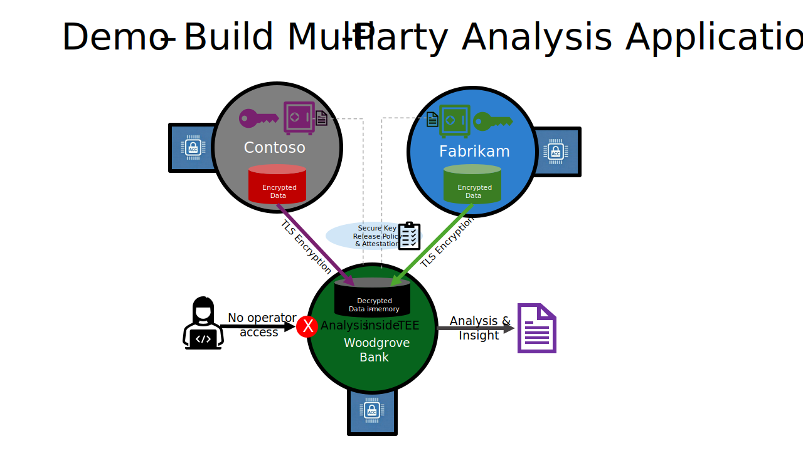
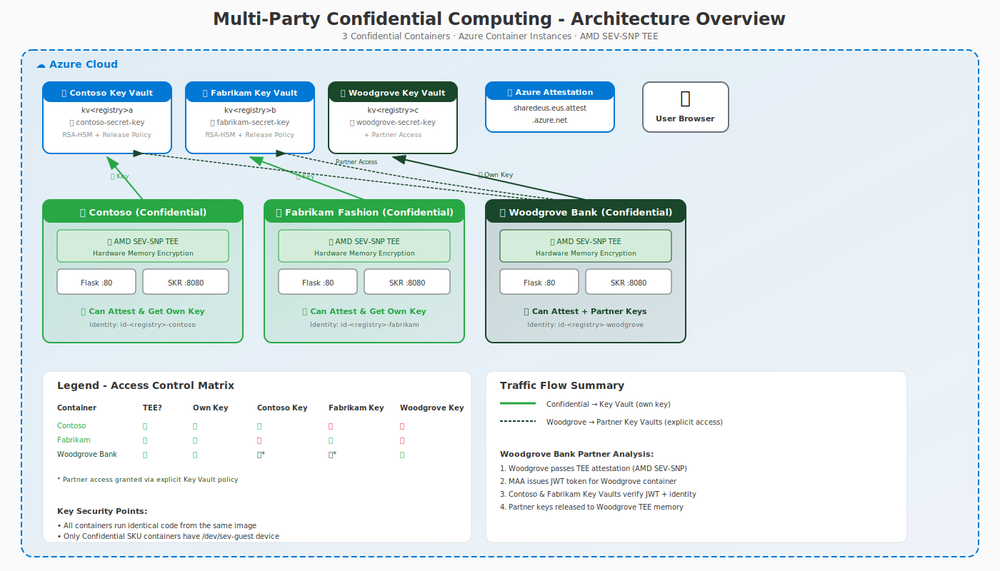
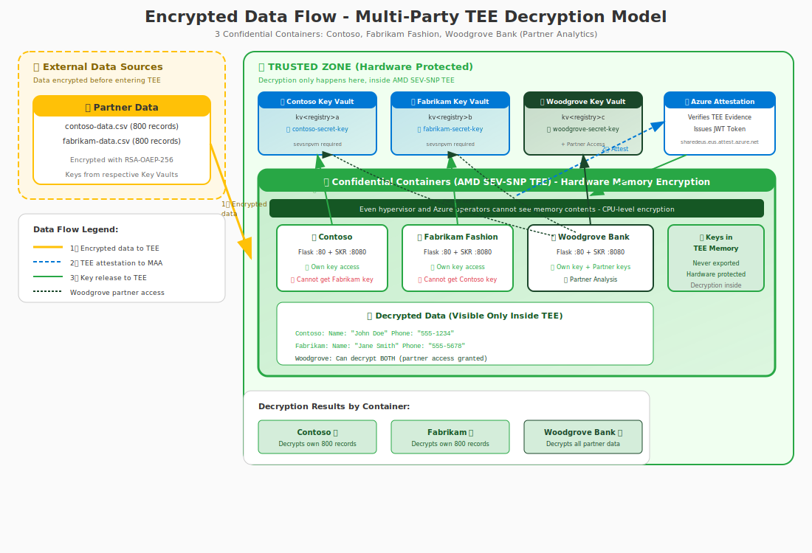

# Multi-Party Confidential Computing Demo

**Author:** Simon Gallagher, Senior Technical Program Manager, Azure Compute Security  
**Last Updated:** March 2026

## 🤖 AI-Generated Content

> **Note:** This entire multi-party demonstration was **created using AI-assisted development** with GitHub Copilot powered by Claude. This showcases the capabilities of modern AI models for developing complex security-focused applications. While functional, AI-generated code should always be reviewed by qualified security professionals before use in production scenarios.

A demonstration of Azure Confidential Container Instances (ACI) with AMD SEV-SNP hardware protection, showing how multiple parties can securely collaborate while protecting their data from each other and from infrastructure operators.

## High-Level Topology



## Overview

This project deploys **three containers** running identical code to demonstrate multi-party confidential computing:

| Container | SKU | Hardware | Can Attest? | Can Release Keys? | Special Features |
|-----------|-----|----------|-------------|-------------------|------------------|
| **Contoso** | Confidential | AMD SEV-SNP TEE | ✅ Yes | ✅ Own key only | Corporate data provider (🏢) |
| **Fabrikam Fashion** | Confidential | AMD SEV-SNP TEE | ✅ Yes | ✅ Own key only | Online retailer (👗) |
| **Woodgrove Bank** | Confidential | AMD SEV-SNP TEE | ✅ Yes | ✅ Own + Partner keys | Analytics partner (🏦) |

### Key Features

- **Multi-Party Isolation** - Each company has separate Key Vault keys bound to their container identity
- **Partner Analytics** - Woodgrove Bank can access Contoso and Fabrikam Fashion keys for aggregate analysis
- **Hardware-Based Security** - AMD SEV-SNP memory encryption at the CPU level
- **Remote Attestation** - Cryptographic proof via Microsoft Azure Attestation (MAA)
- **Secure Key Release (SKR)** - Keys only released to attested confidential containers
- **Cross-Company Protection** - Contoso cannot access Fabrikam Fashion's key, and vice versa
- **Real-time Progress** - SSE streaming with progress bars and time estimates
- **Demographics Analysis** - Top 10 countries with top 3 cities, generational breakdowns, salary averages, salary by country world map
- **Interactive Web UI** - Real-time demonstration of attestation and encryption
- **Attestation Claim Explanations** - Detailed breakdown of every MAA token claim, grouped by category with human-readable descriptions
- **Container Access Testing** - Live proof that SSH, exec, and shell access are blocked by the ccePolicy
- **Unique Per-Deployment Storage** - Each deployment uses `consolidated-records-{resource_group}.json`
- **AI Chat Assistant** - Natural language queries over analytics results powered by Azure OpenAI (gpt-4o-mini), with data isolation ensuring the LLM only sees aggregate summaries

## Architecture



The demo deploys:
- **3 Confidential Containers** (Contoso, Fabrikam Fashion, Woodgrove Bank) - Running on AMD SEV-SNP hardware with TEE protection
- **3 Key Vaults** - Separate Premium HSM-backed vaults for each company's encryption keys

> **📄 Security Policy Deep Dive:** See [SECURITY-POLICY.md](SECURITY-POLICY.md) for an annotated example of the Confidential Computing Enforcement Policy (ccePolicy) that cryptographically binds each container's identity.

## Encrypted Data Flow



### How It Works

1. **Encrypted Data at Rest** - All company data is stored encrypted in Azure Blob Storage
2. **Attestation First** - Before decryption, the container must prove it's running in a genuine AMD SEV-SNP TEE
3. **Key Release** - Azure Key Vault only releases the decryption key after verifying the attestation JWT
4. **Decryption Inside TEE** - The key is released directly into TEE-protected memory; decryption happens inside the hardware-isolated enclave
5. **Plaintext Never Leaves TEE** - Decrypted data exists only in encrypted memory, protected from even infrastructure operators

### Woodgrove Bank Partner Analysis

Woodgrove Bank demonstrates **trusted multi-party analytics**:
- Contoso and Fabrikam explicitly grant Woodgrove access to their Key Vaults
- Woodgrove can release partner keys after passing TEE attestation
- Enables aggregate demographic analysis across partner datasets
- All access is logged in Azure for compliance and audit

### Why Attackers Cannot Decrypt

| Attack Vector | Protection |
|--------------|------------|
| **Compromise Storage** | Data is encrypted; no key available outside TEE |
| **Compromise Network** | TLS + encrypted payloads; key never transmitted |
| **Compromise Container** | Standard containers cannot attest; no key release |
| **Compromise Hypervisor** | SEV-SNP encrypts memory at CPU level |
| **Infrastructure Operator** | Cannot read TEE memory; attestation blocks access |

## Prerequisites

- **Azure CLI** (v2.60+) - [Install Azure CLI](https://docs.microsoft.com/en-us/cli/azure/install-azure-cli)
- **Azure Subscription** - With permissions to create Container Instances, Container Registry, and Key Vault
- **Docker Desktop** - [Download Docker Desktop](https://www.docker.com/products/docker-desktop/) (required for confidential container policy generation)
- **PowerShell** - Version 7.0+ recommended ([PowerShell 7+ download](https://learn.microsoft.com/en-us/powershell/scripting/install/installing-powershell))

### Azure CLI Extensions

```powershell
# Install or update the confcom extension (required for security policy generation)
az extension add --name confcom --upgrade

# Verify installation
az confcom --version
```

## Quick Start

### Step 1: Build the Container Image

```powershell
.\Deploy-MultiFinanceAI.ps1 -Prefix <yourcode> -Build
```

> **Prefix**: Use a short, unique identifier (3-8 chars) like your initials (`jd01`), team code (`team42`), or project name (`demo`). This helps identify resource ownership in shared subscriptions.

This creates:
- **Azure Resource Group** - Named `<prefix><registryname>-rg` (default: East US)
- **Azure Container Registry (ACR)** - Basic SKU with admin enabled
- **Contoso Key Vault** - Premium HSM with `contoso-secret-key`
- **Fabrikam Key Vault** - Premium HSM with `fabrikam-secret-key`
- **Woodgrove Bank Key Vault** - Premium HSM with `woodgrove-secret-key`
- **Managed Identities** - Separate identity for each company's container
- **Cross-Company Access** - Woodgrove granted access to Contoso and Fabrikam Key Vaults
- **Container Image** - Built and pushed to ACR

### Step 2: Deploy All Containers

```powershell
.\Deploy-MultiFinanceAI.ps1 -Prefix <yourcode> -Deploy
```

Deploys three containers:
- **Contoso** - Confidential SKU with AMD SEV-SNP TEE (corporate data provider)
- **Fabrikam Fashion** - Confidential SKU with AMD SEV-SNP TEE (online retailer)
- **Woodgrove Bank** - Confidential SKU with AMD SEV-SNP TEE and partner access (analytics partner)

> ⚠️ **Requires Docker to be running** for security policy generation.

### Combined Build and Deploy

```powershell
.\Deploy-MultiFinanceAI.ps1 -Prefix <yourcode> -Build -Deploy
```

### Cleanup All Resources

```powershell
.\Deploy-MultiFinanceAI.ps1 -Prefix <yourcode> -Cleanup
```

## Command Reference

| Parameter | Description |
|-----------|-------------|
| `-Prefix <code>` | **REQUIRED.** Short unique identifier (3-8 chars, e.g., `jd01`, `dev`, `team42`) |
| `-Build` | Build and push container image to ACR (creates RG, ACR, Key Vaults) |
| `-Deploy` | Deploy all 3 containers (Contoso, Fabrikam Fashion, Woodgrove Bank) |
| `-Cleanup` | Delete all Azure resources in the resource group |
| `-SkipBrowser` | Don't open Microsoft Edge browser after deployment |
| `-RegistryName <name>` | Custom ACR name (default: random 8-character string) |
| `-Location <region>` | Azure region to deploy into (default: `eastus`). MAA endpoint is auto-resolved for the region. |
| `-Description <text>` | Optional description tag for the resource group |

**Note:** Run the script without parameters to see usage help and current configuration.

### Examples

```powershell
# Show help and current configuration
.\Deploy-MultiFinanceAI.ps1

# Build with your initials as prefix
.\Deploy-MultiFinanceAI.ps1 -Prefix jd01 -Build

# Build with custom registry name
.\Deploy-MultiFinanceAI.ps1 -Prefix dev -Build -RegistryName "myregistry"

# Deploy and skip browser
.\Deploy-MultiFinanceAI.ps1 -Prefix team42 -Deploy -SkipBrowser

# Full workflow: build and deploy
.\Deploy-MultiFinanceAI.ps1 -Prefix acme -Build -Deploy

# Delete all resources
.\Deploy-MultiFinanceAI.ps1 -Prefix acme -Cleanup
```

## What You'll See

After deployment, a browser opens with a 3-tabs for a comparison view:

```
+------------------+------------------+------------------+
|     CONTOSO      | FABRIKAM FASHION |  WOODGROVE BANK  |
| (Confidential)   |  (Confidential)  |  (Confidential)  |
|       🏢         |       👗         |       🏦         |
| ✅ Attestation   | ✅ Attestation   | ✅ Attestation   |
| ✅ Key Release   | ✅ Key Release   | ✅ Key Release   |
| ✅ Encryption    | ✅ Encryption    | ✅ Partner Keys  |
| ✅ Own data      | ✅ Own data      | ✅ Partner data + AI chatbot  |
+------------------+------------------+------------------+
```

### Woodgrove Bank Special Features

- **Custom branding** - Green bank theme with 🏦 logo
- **Partner Analysis System** - Dedicated section for cross-company key release
- **Progress tracking** - Visual indicators for Contoso and Fabrikam key release
- **Analysis log** - Real-time log of partner key release operations

## Demo Script

### Basic Attestation Demo

1. **Show Contoso**: Expand "Remote Attestation" → Click "Request Attestation Token" → Success
2. **Explain Claims**: Click "📖 Detailed Explanation of Each Claim" → Walk through categories (JWT Standard, Platform Identity, Hardware Identity, Security State, etc.) showing what each claim proves
3. **Highlight Key Claims**: Point out `x-ms-sevsnpvm-hostdata` (security policy hash), `x-ms-sevsnpvm-is-debuggable: false`, and `x-ms-attestation-type: sevsnpvm`
4. **Show Fabrikam Fashion**: Same actions → Also succeeds (pink fashion theme)
5. **Show Woodgrove Bank**: Same actions → Also succeeds (green bank theme)

### Container Access Test Demo

6. **Test Container Access**: On any container, expand "Try to Access Container OS" → Click "Attempt to Connect"
7. **Review Results**: All four tests show 🛡️ BLOCKED — SSH refused, exec blocked, stdio denied, privilege escalation prevented
8. **Explain Policy Binding**: Show how `exec_processes: []` and `allow_stdio_access: false` in the ccePolicy prevent even the cloud operator from accessing the container OS

### Secure Key Release Demo

9. **Release Key on Contoso**: Expand "Secure Key Release" → Click release → Key obtained
10. **Cross-Company Test**: On Contoso, expand "Cross-Company Key Access" → Shows cannot access Fabrikam Fashion's key

### Partner Analysis Demo (Woodgrove Bank)

11. **Open Woodgrove Bank**: Notice custom green bank branding with 🏦 logo
12. **Expand "Partner Demographic Analysis"**: Click "Start Partner Demographic Analysis"
13. **Watch Progress**: Contoso key release ✅, then Fabrikam Fashion key release ✅
14. **Review Results**: Demographics by country, generation breakdown by company, salary world map
15. **Review Log**: Shows attestation passed for each partner

## Security Model

### Per-Company Key Vault Keys

Each company has a separate Key Vault with an SKR-protected key:

```
Contoso Key Vault: kv<registry>a
├── Key: contoso-secret-key (RSA-HSM, exportable)
└── Release Policy: sevsnpvm attestation required

Fabrikam Fashion Key Vault: kv<registry>b  
├── Key: fabrikam-secret-key (RSA-HSM, exportable)
└── Release Policy: sevsnpvm attestation required

Woodgrove Bank Key Vault: kv<registry>c
├── Key: woodgrove-secret-key (RSA-HSM, exportable)
├── Release Policy: sevsnpvm attestation required
└── Cross-Company Access: Can also release Contoso and Fabrikam Fashion keys
```

### Woodgrove Partner Access

Woodgrove Bank's managed identity is granted explicit access to partner Key Vaults:

```powershell
# Granted during Build phase
az keyvault set-policy --name $ContosoKeyVault --object-id $WoodgroveIdentity --key-permissions get release
az keyvault set-policy --name $FabrikamKeyVault --object-id $WoodgroveIdentity --key-permissions get release
```

### Release Policy

```json
{
  "version": "1.0.0",
  "anyOf": [{
    "authority": "https://sharedeus.eus.attest.azure.net",
    "allOf": [{
      "claim": "x-ms-attestation-type",
      "equals": "sevsnpvm"
    }]
  }]
}
```

This ensures:
- Only containers with valid AMD SEV-SNP attestation can release keys
- Snooper cannot fake attestation (hardware-enforced)
- Each company's key has its own policy
- Woodgrove can access partner keys only because of explicit Key Vault access grants

### Single-Image Design (Demo Limitation)

All containers run the **same Docker image**, which includes both `contoso-data.csv` and `fabrikam-data.csv`. At runtime, each container only reads its own CSV (determined by the released SKR key name), but the other company's file is physically present in the container filesystem.

This is acceptable for a demo with synthetic data, but in production each party should build a **separate image** containing only their own data, or inject data at deploy time via secure channels (e.g. encrypted blob download inside the TEE after attestation).

## Files

| File | Description |
|------|-------------|
| `Deploy-MultiFinanceAI.ps1` | Main deployment script |
| `app.py` | Flask application with all API endpoints |
| `Dockerfile` | Multi-stage build with SKR sidecar |
| `templates/index.html` | Interactive web UI |
| `contoso-data.csv` | Sample data for Contoso (50 records) |
| `fabrikam-data.csv` | Sample data for Fabrikam (50 records) |
| `deployment-template-original.json` | ARM template for Confidential SKU (direct ACI) |
| `deployment-template-woodgrove-base.json` | ARM template for Woodgrove with partner env vars (direct ACI) |
| `deployment-template-standard.json` | ARM template for Standard SKU |
| `MultiPartyTopology.svg` | High-level topology diagram |
| `MultiPartyArchitecture.svg` | Detailed architecture diagram |
| `DataFlowDiagram.svg` | Encrypted data flow diagram showing TEE decryption |
| `requirements.txt` | Python dependencies including `openai` for AI Chat |

## AI Chat Assistant

The Woodgrove Bank dashboard includes an **AI Chat Assistant** powered by Azure OpenAI (gpt-4o-mini). After partner analytics complete, users can ask natural language questions about the results.

### How It Works

1. **Analytics run first (no OpenAI involved)** — The SSE streaming pipeline decrypts 1000 records from Contoso + Fabrikam inside the confidential container, then computes all financial analytics (spending by category, hourly patterns, loan insights, top merchants, country breakdowns, age groups, cross-tabulations)
2. **Summary cached** — At the end of the analytics pipeline, a structured summary dict is cached in memory. This contains only aggregate/statistical data: totals, averages, distributions, and counts — **not** individual transaction records
3. **User asks a question** — The frontend POSTs to `/partner/chat` with the question (max 500 chars, rate-limited to 10 calls/minute)
4. **Single API call to Azure OpenAI** — A `chat.completions.create` call is made with two messages:
   - **System message** — Contains a persona ("You are Woodgrove Bank's financial analytics assistant"), guardrails (only answer from provided data, never fabricate, keep answers concise), and the cached analytics summary serialized as JSON
   - **User message** — The question verbatim
5. **Stateless** — Each question is a single-turn call. No conversation history is maintained between questions. Parameters: `gpt-4o-mini`, `max_tokens=800`, `temperature=0.3`

### What Gets Sent to OpenAI

The system prompt includes **only pre-computed aggregates** from the analytics cache:

| Data Category | Example Sent | Never Sent |
|--------------|-------------|------------|
| Transaction counts | `total_transactions: 1000` | Individual transaction records |
| Spend by category | `{"Groceries": 45230.50, "Electronics": 23100.00}` | Card numbers, merchant IDs |
| Hourly patterns | `{"14": 890, "15": 720}` | Individual timestamps |
| Loan insights | `{"avg_mortgage_payment": 1850.00}` | Individual loan records |
| Country aggregates | `{"US": {"total_spend": 800000}}` | Individual customer locations |
| Partner totals | `{"Contoso": ..., "Fabrikam": ..., "Combined": ...}` | Per-customer spending |
| Cross-tabulations | `{"groceries_peak_hour": 12}` | Raw correlation data |

The LLM **never** sees: raw transaction records, encryption keys, attestation tokens, security policy hashes, storage connection strings, partner URLs, or individual customer data from Contoso or Fabrikam.

### Provisioning

The `-Build` phase of `Deploy-MultiFinanceAI.ps1` automatically:
- Creates an Azure OpenAI account (`{prefix}-openai-finance`)
- Deploys the `gpt-4o-mini` model with GlobalStandard SKU
- Stores the API key in the Woodgrove Key Vault

No manual Azure OpenAI setup is required.

### OpenAI Connectivity Diagnostics

The dashboard includes built-in diagnostics for verifying the OpenAI connection. After every analytics run, Phase 10 of the SSE stream automatically tests:

1. **DNS resolution** — Resolves the OpenAI endpoint hostname, reports resolved IPs and timing
2. **TCP connectivity** — Opens a socket to the endpoint on port 443, reports connect time
3. **API health** — Sends an authenticated `GET` to the deployment endpoint, reports HTTP status
4. **Live completion test** — Sends a minimal prompt ("Reply with exactly: OK") to verify end-to-end LLM functionality, reports model, reply, timing, and token usage

Results appear in the on-page log with ✓/✗/⚠ indicators. A standalone `/partner/openai-diag` endpoint is also available for on-demand diagnostics.

### Disabling Chat

If the `AZURE_OPENAI_ENDPOINT` environment variable is empty or unset, the chat feature is gracefully disabled. The chat toggle button will not appear on the dashboard.

## API Endpoints

| Endpoint | Method | Description |
|----------|--------|-------------|
| `/` | GET | Main web UI |
| `/attest/maa` | POST | Request MAA attestation token |
| `/attest/raw` | POST | Get raw attestation report |
| `/skr/release` | POST | Release company's SKR key |
| `/skr/release-other` | POST | Attempt cross-company key access |
| `/skr/release-partner` | POST | Release partner key (Woodgrove only) |
| `/skr/config` | GET | Get SKR configuration |
| `/encrypt` | POST | Encrypt data with released key |
| `/decrypt` | POST | Decrypt data with released key |
| `/company/info` | GET | Get company identity |
| `/company/list` | GET | List encrypted records stored on this container |
| `/company/populate` | POST | Encrypt CSV data and store locally |
| `/partner/analyze` | POST | Run partner demographic analysis (non-streaming) |
| `/partner/analyze-stream` | GET | SSE streaming partner analysis with progress |
| `/container/access-test` | POST | Attempt SSH/exec/shell access (all blocked by ccePolicy) |
| `/debug/partner-keys` | GET | Inspect stored partner key structure (diagnostics) |
| `/debug/test-partner-decrypt` | POST | Test single-record partner decryption with detailed errors |
| `/partner/chat` | POST | Ask a natural language question about analytics results (requires Azure OpenAI) |
| `/partner/chat-status` | GET | Check if AI Chat is available (OpenAI configured + analytics cached) |
| `/partner/openai-diag` | GET | Run full OpenAI connectivity diagnostics (DNS, TCP, API health, completion test) |

## Troubleshooting

### Docker not running
```
ERROR: Docker is not running. Required for security policy generation.
```
**Solution:** Start Docker Desktop before running `-Deploy`.

### Policy generation fails
```
Failed to generate security policy
```
**Solution:** Ensure Docker is running and you're logged into ACR.

### No configuration found
```
acr-config.json not found. Run with -Build first.
```
**Solution:** Run `.\Deploy-MultiFinanceAI.ps1 -Build` before deploying.

### Attestation fails on confidential container
```
Attestation failed with status 500
```
**Solution:** Check container logs for detailed error messages:
```powershell
az container logs -g <resource-group> -n <container-name>
```

### Key release denied
**Solution:** Verify the managed identity has Key Vault permissions and the container is running on Confidential SKU.

### Partner key release fails (Woodgrove)
```
SKR sidecar not available
```
**Solution:** Ensure the Woodgrove container is deployed with the correct template that includes partner Key Vault environment variables.

## Additional Documentation

- [ATTESTATION.md](ATTESTATION.md) - Technical details about attestation
- [README-MultiParty.md](README-MultiParty.md) - Comprehensive multi-party demo documentation

## References

- [Security Policy Deep Dive (SECURITY-POLICY.md)](SECURITY-POLICY.md) — Annotated ccePolicy example with decoded Rego
- [Attestation Technical Details (ATTESTATION.md)](ATTESTATION.md) — JWT structure, SKR flow, troubleshooting
- [Azure Confidential Container Samples](https://github.com/Azure-Samples/confidential-container-samples)
- [Azure Container Instances - Confidential Containers](https://learn.microsoft.com/en-us/azure/container-instances/container-instances-confidential-overview)
- [Microsoft Azure Attestation](https://learn.microsoft.com/en-us/azure/attestation/overview)
- [AMD SEV-SNP](https://www.amd.com/en/developer/sev.html)
- [az confcom Extension](https://learn.microsoft.com/en-us/cli/azure/confcom)

## ⚠️ Disclaimer

This code is provided for **educational and demonstration purposes only**.

- **No Warranty:** Provided "AS IS" without warranty of any kind, express or implied
- **Not Production-Ready:** Requires thorough review and modification before production use
- **User Responsibility:** Users are solely responsible for:
  - Security review of all code before deployment
  - Compliance with organizational security policies
  - Validating cryptographic implementations
  - Proper key management and secret handling
  - Any data processed using these samples

## License

MIT License
