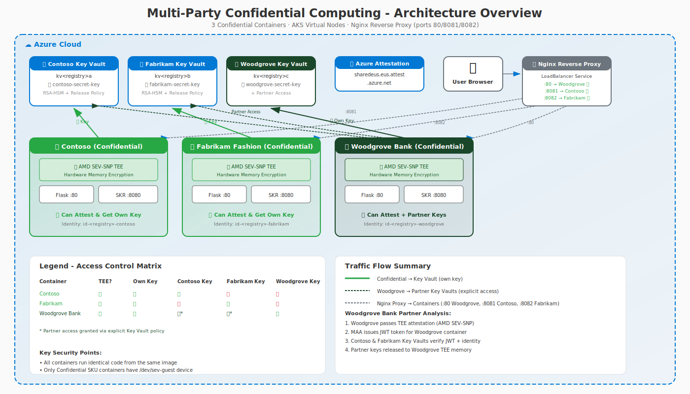

# Multi-Party Confidential Computing Demo

**Author:** Simon Gallagher, Senior Technical Program Manager, Azure Compute Security  
**Last Updated:** February 2026

This demonstration shows how Azure Confidential Containers enable secure multi-party computation where each party's data remains protected, even from other parties and infrastructure operators.

## Architecture Overview



## Encrypted Data Flow


**Key Insight:** Data remains encrypted at rest and in transit. Decryption **only** occurs inside the AMD SEV-SNP Trusted Execution Environment (TEE), where memory is hardware-encrypted at the CPU level.

## Overview

The demo deploys **three confidential containers** running identical code, demonstrating how hardware-based security and partner trust relationships enable secure multi-party data sharing:

| Container | SKU | Hardware | Can Attest? | Can Get Keys? | Can Decrypt Data? |
|-----------|-----|----------|-------------|---------------|-------------------|
| **Contoso** | Confidential | AMD SEV-SNP TEE | ✅ Yes | ✅ Own key only | ✅ Own data only |
| **Fabrikam Fashion** | Confidential | AMD SEV-SNP TEE | ✅ Yes | ✅ Own key only | ✅ Own data only |
| **Woodgrove Bank** | Confidential | AMD SEV-SNP TEE | ✅ Yes | ✅ Own + Partner | ✅ All partner data |

## Key Concepts

### Why This Matters

In traditional cloud computing, infrastructure operators (cloud providers, IT admins) can potentially access data in memory. Confidential computing solves this by:

1. **Hardware Isolation**: AMD SEV-SNP encrypts memory at the CPU level
2. **Remote Attestation**: Cryptographic proof that code is running in a genuine TEE
3. **Secure Key Release (SKR)**: Keys are only released to attested environments
4. **Company Isolation**: Each company's key is bound to their container identity

### Woodgrove Bank: Trusted Partner Analytics

Woodgrove Bank demonstrates a **trusted third-party analytics** scenario:
- Operates as a financial analytics partner for Contoso and Fabrikam
- Both companies explicitly grant Woodgrove access to their Key Vaults
- Woodgrove must still pass TEE attestation to release partner keys
- Enables aggregate demographic analysis while maintaining cryptographic guarantees

**Key features:**
- Woodgrove runs in a **Confidential** container (can attest)
- Woodgrove has **explicit permission** from partners (Key Vault access policies)
- All access is **audited** in Azure for compliance

### Cross-Company Isolation

Even between trusted parties (Contoso and Fabrikam Fashion):
- Each company has a **separate Key Vault key** with its own release policy
- Contoso's key is bound to Contoso's container identity
- Fabrikam cannot access Contoso's key, and vice versa

**Woodgrove Bank exception:**
- Woodgrove can access both partner keys because partners **explicitly granted** access
- This is not a security bypass - it's intentional delegation for analytics
- Enables cross-company demographic analysis inside TEE-protected memory

## Traffic Flow

### Successful Attestation & Key Release (Contoso/Fabrikam/Woodgrove)

```
User Browser → Flask App (:80) → SKR Sidecar (:8080)
                                        ↓
                              Microsoft Azure Attestation
                                        ↓
                              JWT Token (signed attestation)
                                        ↓
                              Azure Key Vault (Premium HSM)
                                        ↓
                              Private Key → TEE Memory
                                        ↓
                              Encrypt/Decrypt Operations
```

### Woodgrove Partner Key Release

```
Woodgrove Container → SKR Sidecar (:8080)
                              ↓
                    Microsoft Azure Attestation
                              ↓
                    JWT Token (Woodgrove TEE)
                              ↓
          ┌─────────────────────────────────────────┐
          ↓                                         ↓
  Contoso Key Vault                        Fabrikam Key Vault
  (Woodgrove has access)                   (Woodgrove has access)
          ↓                                         ↓
  contoso-secret-key                       fabrikam-secret-key
          ↓                                         ↓
          └─────────────────────────────────────────┘
                              ↓
                    Partner Data Analysis
```

### Data Protection Flow

The following diagram shows how encrypted data flows from storage to the TEE where it is decrypted:

```
┌─────────────────────────────────────────────────────────────────────────┐
│                        DATA SOURCES                                      │
│  (Raw data encrypted before entering system)                            │
├─────────────────────────────────────────────────────────────────────────┤
│                                                                          │
│   ┌─────────────────┐         ┌─────────────────┐                       │
│   │   contoso.csv   │         │  fabrikam.csv   │                       │
│   │  (800 records)  │         │  (800 records)  │                       │
│   └────────┬────────┘         └────────┬────────┘                       │
│            │                           │                                 │
│            ▼                           ▼                                 │
│   ┌─────────────────┐         ┌─────────────────┐                       │
│   │ Encrypt with    │         │ Encrypt with    │                       │
│   │ Contoso Key     │         │ Fabrikam Key    │                       │
│   │ (RSA-OAEP-256)  │         │ (RSA-OAEP-256)  │                       │
│   └────────┬────────┘         └────────┬────────┘                       │
│            │                           │                                 │
│            └─────────────┬─────────────┘                                │
│                          ▼                                               │
│              ┌───────────────────────┐                                  │
│              │  Encrypted records    │                                  │
│              │  stored in memory     │                                  │
│              └───────────┬───────────┘                                  │
│                          │                                              │
└──────────────────────────┼──────────────────────────────────────────────┘
                           │
┌──────────────────────────┼──────────────────────────────────────────────┐
│                          │     TRUSTED ZONE (AMD SEV-SNP TEE)           │
│  (Data decrypted ONLY here - hardware-encrypted memory)                 │
├──────────────────────────┼──────────────────────────────────────────────┤
│                          ▼                                               │
│              ┌───────────────────────┐                                  │
│              │  1️⃣ Fetch encrypted   │                                  │
│              │     data              │                                  │
│              └───────────┬───────────┘                                  │
│                          │                                               │
│                          ▼                                               │
│              ┌───────────────────────┐      ┌─────────────────────┐     │
│              │  2️⃣ Request           │─────▶│  Azure Attestation  │     │
│              │     attestation       │      │  (MAA)              │     │
│              └───────────────────────┘      │  Verify TEE         │     │
│                          │                  │  Issue JWT          │     │
│                          │◀─────────────────└─────────────────────┘     │
│                          ▼                                               │
│              ┌───────────────────────┐      ┌─────────────────────┐     │
│              │  3️⃣ Request key       │─────▶│  Azure Key Vault    │     │
│              │     with JWT token    │      │  (HSM)              │     │
│              └───────────────────────┘      │  Verify JWT         │     │
│                          │                  │  Release Key        │     │
│                          │◀─────────────────└─────────────────────┘     │
│                          ▼                                               │
│  ┌───────────────────────────────────────────────────────────────────┐  │
│  │  4️⃣ DECRYPTION HAPPENS HERE (in TEE-protected memory)            │  │
│  │     🔓 Key exists only in encrypted memory                        │  │
│  │     🔓 Plaintext exists only in encrypted memory                  │  │
│  │     🔓 Even hypervisor cannot read TEE memory                     │  │
│  └───────────────────────────────────────────────────────────────────┘  │
│                          │                                               │
│            ┌─────────────┼─────────────┐                                │
│            │             │             │                                │
│            ▼             ▼             ▼                                │
│        Contoso       Fabrikam      Woodgrove                            │
│       Decrypts      Decrypts      Decrypts                              │
│       own 800       own 800       ALL partner                           │
│       records       records       records                               │
└─────────────────────────────────────────────────────────────────────────┘
```

## Quick Start

### Prerequisites

- Azure CLI (v2.60+) with `confcom` extension (`az extension add --name confcom --upgrade`)
- Docker Desktop (for security policy generation)
- Azure subscription with Confidential Container support
- PowerShell 7.0+ recommended

### Deploy

```powershell
# Build the container image (first time only)
.\Deploy-MultiParty.ps1 -Prefix <yourcode> -Build

# Deploy all 3 containers
.\Deploy-MultiParty.ps1 -Prefix <yourcode> -Deploy

# Or build and deploy in one command
.\Deploy-MultiParty.ps1 -Prefix <yourcode> -Build -Deploy
```

> **Note:** Replace `<yourcode>` with a short unique identifier (3-8 chars) like your initials or team code.

### Clean Up

```powershell
# Delete all Azure resources (containers, Key Vault keys)
.\Deploy-MultiParty.ps1 -Prefix <yourcode> -Cleanup
```

## What You'll See

After deployment, a browser opens with a 3-pane side-by-side view:

```
+------------------+------------------+------------------+
|     CONTOSO      | FABRIKAM FASHION |  WOODGROVE BANK  |
| (Confidential)   |  (Confidential)  |  (Confidential)  |
|       🏢         |       👗         |       🏦         |
| ✅ Attestation   | ✅ Attestation   | ✅ Attestation   |
| ✅ Key Release   | ✅ Key Release   | ✅ Key Release   |
| ✅ Own data      | ✅ Own data      | ✅ Partner data  |
+------------------+------------------+------------------+
```

### Woodgrove Bank Features

- **Green bank branding** with 🏦 logo
- **Partner Demographic Analysis** section
- **Progress indicators** for Contoso and Fabrikam key release
- **Real-time analysis log**
- **Demographics**: Top 10 countries with top 3 cities, generational breakdown, salary world map

## Demo Script

### Basic Attestation Demo

1. **Show Contoso**: Click "Get Raw Report" - attestation succeeds
2. **Show Fabrikam Fashion**: Same result - attestation succeeds (pink fashion theme)
3. **Show Woodgrove Bank**: Attestation succeeds with green bank theme

### Secure Key Release Demo

4. **Release Key on Contoso**: Expand "Secure Key Release" section, click release
5. **Cross-Company Test**: Contoso tries to access Fabrikam Fashion's key - denied

### Partner Analysis Demo (Woodgrove Bank)

6. **Open Woodgrove Bank pane**: Notice green bank branding with 🏦 logo
7. **Expand "Partner Demographic Analysis"** section
8. **Click "Start Partner Demographic Analysis"**
9. **Watch progress**: Contoso ✅ → Fabrikam ✅
10. **Review results**: Demographics by country, generation breakdown by company, salary world map
11. **Review log**: Shows both partner keys released successfully

## Security Model

### Per-Company Key Vault Keys

```
Azure Key Vault: kv<registry>a (Contoso)
├── Key: contoso-secret-key
├── Type: RSA-HSM (4096-bit)
├── Exportable: true (for SKR)
└── Release Policy: sevsnpvm + Contoso container identity

Azure Key Vault: kv<registry>b (Fabrikam)
├── Key: fabrikam-secret-key
├── Type: RSA-HSM (4096-bit)
├── Exportable: true (for SKR)
└── Release Policy: sevsnpvm + Fabrikam container identity

Azure Key Vault: kv<registry>c (Woodgrove Bank)
├── Key: woodgrove-secret-key
├── Type: RSA-HSM (4096-bit)
├── Exportable: true (for SKR)
├── Release Policy: sevsnpvm + Woodgrove container identity
└── Cross-Company: Access to kv<registry>a and kv<registry>b
```

### Release Policy Example

```json
{
  "version": "1.0.0",
  "anyOf": [{
    "authority": "https://sharedeus.eus.attest.azure.net",
    "allOf": [{
      "claim": "x-ms-attestation-type",
      "equals": "sevsnpvm"
    }]
  }]
}
```

This means:
- Only containers with `x-ms-attestation-type: sevsnpvm` can release the key
- Non-confidential containers cannot obtain this claim - it's verified by AMD hardware
- Each company's key has its own policy tied to their container identity
- Woodgrove has access to partner keys via explicit Key Vault permissions

## Files

| File | Description |
|------|-------------|
| `Deploy-MultiParty.ps1` | Main deployment script with -Prefix, -Build, -Deploy, -Cleanup |
| `app.py` | Flask application with all API endpoints |
| `Dockerfile` | Multi-stage build with SKR sidecar |
| `templates/index.html` | Interactive web UI with all demo features |
| `templates/index-woodgrove.html` | Woodgrove Bank custom UI with partner analytics |
| `contoso-data.csv` | Sample data for Contoso (800 records) |
| `fabrikam-data.csv` | Sample data for Fabrikam Fashion (800 records) |
| `deployment-template-original.json` | ARM template for Confidential SKU |
| `deployment-template-woodgrove-base.json` | ARM template for Woodgrove with partner env vars |
| `MultiPartyArchitecture.svg` | High-level architecture diagram |
| `MultiPartyTopology.svg` | Multi-party topology diagram |
| `DataFlowDiagram.svg` | Encrypted data flow showing TEE decryption model |

## API Endpoints

| Endpoint | Method | Description |
|----------|--------|-------------|
| `/` | GET | Main web UI |
| `/attest/maa` | POST | Request MAA attestation token |
| `/attest/raw` | POST | Get raw attestation report |
| `/skr/release` | POST | Release company's SKR key |
| `/skr/release-other` | POST | Attempt cross-company key access (Contoso/Fabrikam) |
| `/skr/release-partner` | POST | Release partner key (Woodgrove only) |
| `/skr/config` | GET | Get SKR configuration |
| `/encrypt` | POST | Encrypt data with released key |
| `/decrypt` | POST | Decrypt data with released key |
| `/company/info` | GET | Get company identity |
| `/demographics/analyze` | POST | Partner demographic analysis (SSE streaming) |
| `/container/info` | GET | Get container metadata |
| `/health` | GET | Health check endpoint |

## Troubleshooting

### Docker Not Running
```
Error: Docker is not running. Required for security policy generation.
```
Start Docker Desktop before running with `-Deploy`.

### Containers Not Starting
Check container logs:
```powershell
az container logs -g <resource-group> -n <container-name>
```

### Key Release Fails on Confidential Container
Verify the managed identity has Key Vault permissions:
```powershell
az keyvault show --name <vault-name> --query "properties.accessPolicies"
```

### Partner Key Release Fails (Woodgrove)
Ensure Woodgrove container was deployed with partner environment variables:
- `PARTNER_CONTOSO_AKV_ENDPOINT`
- `PARTNER_FABRIKAM_AKV_ENDPOINT`

### Cross-Company Key Access Not Denied
Ensure each container has a unique managed identity and the Key Vault keys have proper release policies bound to specific identities.

## Related Documentation

- [Azure Confidential Computing Overview](https://azure.microsoft.com/solutions/confidential-compute/)
- [AMD SEV-SNP Technical Details](https://www.amd.com/en/developer/sev.html)
- [Azure Container Instances Confidential Containers](https://docs.microsoft.com/azure/container-instances/container-instances-confidential-overview)
- [Azure Key Vault Secure Key Release](https://docs.microsoft.com/azure/key-vault/keys/about-keys-details)
- [Microsoft Azure Attestation](https://docs.microsoft.com/azure/attestation/)
