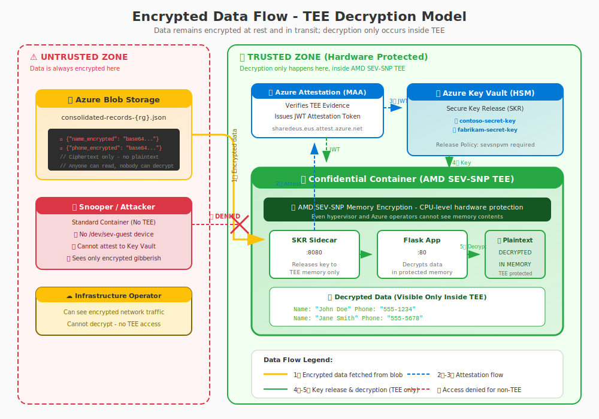

# Attestation Technical Details

**Author:** Simon Gallagher, Senior Technical Program Manager, Azure Compute Security  
**Last Updated:** February 2026

> **Note:** See [README.md](README.md) for the main project documentation.

This document provides additional technical details about the attestation features in this demo.

## Attestation Overview

Remote attestation allows a relying party to verify that:

1. **The workload runs in a genuine TEE** - AMD SEV-SNP hardware
2. **The workload hasn't been tampered with** - Security policy enforcement
3. **The environment is properly configured** - No debugging, correct firmware

## Encrypted Data Flow



The key security principle: **data is encrypted at rest and in transit; decryption ONLY happens inside the TEE**.

| Zone | Data State | Who Can Access |
|------|-----------|----------------|
| **Blob Storage** | Encrypted (RSA-OAEP-256) | Anyone (but useless without key) |
| **Network Transit** | Encrypted (TLS + payload encryption) | Cannot be decrypted |
| **Standard Container** | Encrypted (no key access) | Cannot decrypt - attestation fails |
| **TEE Memory** | Decrypted (hardware-protected) | Only the TEE workload |

### Why TEE Decryption is Secure

1. **Hardware Memory Encryption**: AMD SEV-SNP encrypts all memory at the CPU level
2. **Key Isolation**: Decryption keys exist only in TEE-protected memory
3. **Attestation Binding**: Keys are only released after hardware attestation proves TEE integrity
4. **Hypervisor Excluded**: Even the cloud infrastructure cannot read TEE memory

### Attestation Flow

The demo uses a single container with both Flask and SKR (Secure Key Release) services managed by supervisord.

```
┌──────────────┐     ┌─────────────────────────────────────────────┐
│   Browser    │     │           Combined Container                 │
│              │     │  ┌─────────────────┐  ┌─────────────────┐   │
└──────┬───────┘     │  │   Flask App     │  │  SKR Service    │   │
       │             │  │   (Port 80)     │  │  (Port 8080)    │   │
       │             │  └────────┬────────┘  └────────┬────────┘   │
       │             └───────────┼────────────────────┼────────────┘
       │                         │                    │
       │  POST /attest/maa       │                    │
       │────────────────────────►│                    │
       │                         │  POST /attest/maa  │
       │                         │───────────────────►│
       │                         │                    │
       │                         │    ┌───────────────┼─────────────────┐
       │                         │    │               ▼                 │
       │                         │    │  ┌─────────────────────────┐    │
       │                         │    │  │   AMD SEV-SNP Hardware  │    │
       │                         │    │  │   Generate SNP Report   │    │
       │                         │    │  └────────────┬────────────┘    │
       │                         │    │               │                 │
       │                         │    │               ▼                 │
       │                         │    │  ┌─────────────────────────┐    │
       │                         │    │  │   Microsoft Azure       │    │
       │                         │    │  │   Attestation (MAA)     │    │
       │                         │    │  │   Verify & Sign JWT     │    │
       │                         │    │  └────────────┬────────────┘    │
       │                         │    │               │                 │
       │                         │    └───────────────┼─────────────────┘
       │                         │                    │
       │                         │◄───────────────────│
       │                         │    JWT Token       │
       │◄────────────────────────│                    │
       │   Display Token         │                    │
       │   & Claims              │                    │
```

## JWT Token Structure

The attestation token is a signed JWT with three parts:

### Header
```json
{
  "alg": "RS256",
  "jku": "https://sharedeus.eus.attest.azure.net/certs",
  "kid": "<key-id>",
  "typ": "JWT"
}
```

### Payload Claims

| Claim | Description |
|-------|-------------|
| `x-ms-isolation-tee` | TEE type and configuration |
| `x-ms-sevsnpvm-is-debuggable` | Debug mode (must be `false` for production) |
| `x-ms-sevsnpvm-vmpl` | Virtual Machine Privilege Level |
| `x-ms-sevsnpvm-hostdata` | SHA256 of security policy |
| `x-ms-sevsnpvm-guestsvn` | Guest Security Version Number |
| `x-ms-compliance-status` | Azure compliance status |
| `x-ms-ver` | Attestation service version |
| `iss` | Issuer (MAA endpoint) |
| `exp` | Token expiration |
| `iat` | Issued at timestamp |
| `jti` | Unique token ID |

### Signature

The token is signed by MAA using RSA-256. The public key can be retrieved from the JKU (JSON Web Key URL) in the header.

## Security Policy

The security policy (`ccePolicy`) is generated by `az confcom` and includes:

- **Allowed container images** - Exact image IDs (registry/image:tag)
- **Image layer hashes** - SHA256 hashes of each layer (must match exactly)
- **Allowed commands** - Entry points and arguments
- **Environment variables** - Allowed env var patterns
- **Mount points** - Allowed filesystem mounts
- **Capabilities** - Linux capabilities
- **Stdio access** - Disabled to prevent interactive shell access
- **Exec processes** - Empty list (no exec allowed)

The policy is base64-encoded Rego and embedded in the ARM template.

### Container Image Enforcement

Each container in the policy specifies:
- `id` - The exact image reference (e.g., `myacr.azurecr.io/aci-attestation-demo:latest`)
- `layers` - Array of SHA256 hashes for each image layer

**Only containers with matching image IDs AND layer hashes can run.** If an attacker modifies any layer, the hash won't match and the container will be rejected.

Example from the policy:
```json
{
  "id": "myacr.azurecr.io/aci-attestation-demo:latest",
  "layers": [
    "ffeb5c88c5667f9edaa3b8380636b4c3c9057dd53d11e78f691f4fc3497e57d7",
    "a6d080858cb2a978e86257b184dc8b8610a5d0a42c0392122033d89a93351f64",
    ...
  ]
}
```

### Security Hardening

The policy is generated with the `--disable-stdio` flag which:
- Sets `allow_stdio_access` to `false` for all containers
- Prevents `az container exec` and shell access
- Blocks interactive debugging into the TEE
- Ensures container contents remain confidential

Additional hardening settings:
| Setting | Value | Effect |
|---------|-------|--------|
| `allow_elevated` | `false` | No root privilege escalation |
| `allow_dump_stacks` | `false` | No debug stack dumps |
| `allow_runtime_logging` | `false` | No runtime logging |
| `allow_unencrypted_scratch` | `false` | All scratch storage encrypted |
| `exec_processes` | `[]` | No additional processes can be executed |

### Generating the Policy

```powershell
az confcom acipolicygen -a deployment-template.json --parameters deployment-params.json --disable-stdio
```

This:
1. Pulls container images locally
2. Analyzes image layers and configuration
3. Generates Rego policy
4. Encodes and injects into template

## SKR Service (Secure Key Release)

The SKR binary is extracted from `mcr.microsoft.com/aci/skr:2.7` during the Docker multi-stage build and runs alongside Flask via supervisord. It provides the following endpoints on port 8080:

| Endpoint | Method | Description |
|----------|--------|-------------|
| `/attest/maa` | POST | Request MAA attestation token |
| `/attest/raw` | POST | Get raw SNP attestation report |
| `/status` | GET | SKR service health status |

### MAA Request Format

```json
{
  "maa_endpoint": "sharedeus.eus.attest.azure.net",
  "runtime_data": "<base64-encoded-data>"
}
```

### MAA Response

```json
{
  "token": "<jwt-attestation-token>"
}
```

## Dynamic Security Features UI

The web UI dynamically updates security feature indicators based on attestation results:

| Feature | Verified When |
|---------|---------------|
| AMD SEV-SNP TEE | Token contains `x-ms-isolation-tee` |
| Memory Encryption | Token contains `x-ms-sevsnpvm-vmpl` |
| Data Confidentiality | Compliance status is `azure-compliant-cvm` |
| Security Policy | Token contains `x-ms-sevsnpvm-hostdata` |
| Remote Attestation | Valid token received |
| Runtime Protection | `x-ms-sevsnpvm-is-debuggable` is `false` |

## Files Reference

| File | Purpose |
|------|---------|
| `Deploy-SimpleDemo.ps1` | Main script for build, deploy, cleanup |
| `app.py` | Flask routes, forwards attestation requests to SKR |
| `supervisord.conf` | Process supervisor config for Flask + SKR |
| `templates/index.html` | Interactive UI with JavaScript for attestation |
| `deployment-template-original.json` | ARM template with Confidential SKU |
| `deployment-template-standard.json` | ARM template with Standard SKU |
| `Dockerfile` | Multi-stage build (Flask + SKR binary) |
| `requirements.txt` | Python dependencies (Flask, requests) |
| `acr-config.json` | Generated configuration (no secrets, created by `-Build`) |

## Troubleshooting Attestation

### "Connection refused" error

The SKR service is not running. Check container logs to verify supervisord started both processes:
```powershell
az container logs -g <resource-group> -n <container-name> --container-name attestation-demo
```

### "400 Bad Request" from MAA

Check the MAA endpoint format. It should be just the hostname without `https://`:
```
sharedeus.eus.attest.azure.net
```

### Token parsing fails

The token may be malformed. Check the raw response in the browser console.

### Claims show unexpected values

Verify the container is running on confidential hardware:
```powershell
az container show --name <name> --resource-group <rg> --query "sku"
# Should return "Confidential"
```

### Attestation fails on Snooper container

This is expected. The Snooper container is deployed with Standard SKU (no TEE hardware), so attestation will fail. The error response from the SKR service will be displayed in the UI, demonstrating what happens when a non-confidential container attempts to access protected resources.

## References

- [ACI Confidential Containers Overview](https://learn.microsoft.com/en-us/azure/container-instances/container-instances-confidential-overview)
- [Azure Attestation Overview](https://learn.microsoft.com/en-us/azure/attestation/overview)
- [AMD SEV-SNP Technical Documentation](https://www.amd.com/en/developer/sev.html)
- [az confcom Extension](https://learn.microsoft.com/en-us/cli/azure/confcom)
