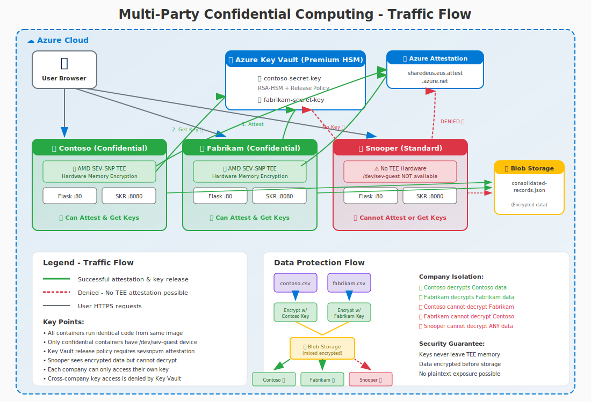

# Multi-Party Confidential Computing Demo

**Author:** Simon Gallagher, Senior Technical Program Manager, Azure Compute Security  
**Last Updated:** February 2026

## 🤖 AI-Generated Content

> **Note:** This entire multi-party demonstration was **created using AI-assisted development** with GitHub Copilot powered by Claude. While functional, AI-generated code should always be reviewed by qualified security professionals before use in production scenarios.

A demonstration of Azure Confidential Container Instances (ACI) with AMD SEV-SNP hardware protection, showing how multiple parties can securely collaborate while protecting their data from each other and from infrastructure operators.

## Architecture


```
┌─────────────────────────────────────────────────────────────────┐
│              Demo App - 2 Party Architecture                        │
├─────────────────────────────────────────────────────────────────┤
│                                                                    │
│   ┌──────────────────────────┐   ┌────────────────────────────┐   │
│   │     Contoso 🏢           │   │   Fabrikam Fashion 👗    │   │
│   │   Confidential ACI      │   │   Confidential ACI       │   │
│   │   AMD SEV-SNP TEE       │   │   AMD SEV-SNP TEE        │   │
│   │                        │   │                          │   │
│   │   ✓ Attestation         │   │   ✓ Attestation          │   │
│   │   ✓ Own key release     │   │   ✓ Own key release      │   │
│   │   ✗ Cannot access       │   │   ✗ Cannot access        │   │
│   │     Fabrikam's key     │   │     Contoso's key       │   │
│   └────────────┬─────────────┘   └─────────────┬──────────────┘   │
│                │                           │                    │
│                ▼                           ▼                    │
│   ┌───────────────────────────────────────────────────────┐   │
│   │                Azure Blob Storage                          │   │
│   │              consolidated-records-{rg}.json                 │   │
│   │    ┌───────────────────┐    ┌──────────────────────┐      │   │
│   │    │ Contoso Records   │    │  Fabrikam Records    │      │   │
│   │    │ (RSA Encrypted)   │    │  (RSA Encrypted)     │      │   │
│   │    └───────────────────┘    └──────────────────────┘      │   │
│   └───────────────────────────────────────────────────────┘   │
│                                                                    │
│   ┌──────────────────────────┐   ┌────────────────────────────┐   │
│   │     Key Vault A          │   │     Key Vault B            │   │
│   │     (Contoso Key)        │   │     (Fabrikam Key)         │   │
│   │     SKR Protected        │   │     SKR Protected          │   │
│   └──────────────────────────┘   └────────────────────────────┘   │
└─────────────────────────────────────────────────────────────────┘
```

## Overview

This project deploys **three containers** running identical code to demonstrate multi-party confidential computing:

| Container | SKU | Hardware | Can Attest? | Can Release Keys? |
|-----------|-----|----------|-------------|-------------------|
| **Contoso** | Confidential | AMD SEV-SNP TEE | ✅ Yes | ✅ Own key only |
| **Fabrikam** | Confidential | AMD SEV-SNP TEE | ✅ Yes | ✅ Own key only |
| **Snooper** | Standard | None | ❌ No | ❌ No keys |

### Key Features

- **Multi-Party Isolation** - Each company has separate Key Vault keys bound to their container identity
- **Hardware-Based Security** - AMD SEV-SNP memory encryption at the CPU level
- **Remote Attestation** - Cryptographic proof via Microsoft Azure Attestation (MAA)
- **Secure Key Release (SKR)** - Keys only released to attested confidential containers
- **Cross-Company Protection** - Contoso cannot access Fabrikam's key, and vice versa
- **Attacker Visualization** - Snooper container shows what an attacker sees (encrypted data only)
- **Interactive Web UI** - Real-time demonstration of attestation and encryption
- **Attestation Claim Explanations** - Detailed breakdown of every MAA token claim, grouped by category with human-readable descriptions
- **Container Access Testing** - Live proof that SSH, exec, and shell access are blocked by the ccePolicy
- **Unique Per-Deployment Storage** - Each deployment uses `consolidated-records-{resource_group}.json`

## Architecture



The demo deploys:
- **2 Confidential Containers** (Contoso, Fabrikam) - Running on AMD SEV-SNP hardware with TEE protection
- **1 Standard Container** (Snooper) - Running without TEE hardware to demonstrate attack scenarios
- **2 Key Vaults** - Separate Premium HSM-backed vaults for each company's encryption keys
- **Shared Blob Storage** - Contains encrypted data from all parties

## Encrypted Data Flow


### How It Works

1. **Encrypted Data at Rest** - All company data is stored encrypted in Azure Blob Storage
2. **Attestation First** - Before decryption, the container must prove it's running in a genuine AMD SEV-SNP TEE
3. **Key Release** - Azure Key Vault only releases the decryption key after verifying the attestation JWT
4. **Decryption Inside TEE** - The key is released directly into TEE-protected memory; decryption happens inside the hardware-isolated enclave
5. **Plaintext Never Leaves TEE** - Decrypted data exists only in encrypted memory, protected from even infrastructure operators

### Why Attackers Cannot Decrypt

| Attack Vector | Protection |
|--------------|------------|
| **Compromise Storage** | Data is encrypted; no key available outside TEE |
| **Compromise Network** | TLS + encrypted payloads; key never transmitted |
| **Compromise Container** | Standard containers cannot attest; no key release |
| **Compromise Hypervisor** | SEV-SNP encrypts memory at CPU level |
| **Infrastructure Operator** | Cannot read TEE memory; attestation blocks access |

## Prerequisites

- **Azure CLI** (v2.60+) - [Install Azure CLI](https://docs.microsoft.com/en-us/cli/azure/install-azure-cli)
- **Azure Subscription** - With permissions to create Container Instances, Container Registry, and Key Vault
- **Docker Desktop** - [Download Docker Desktop](https://www.docker.com/products/docker-desktop/) (required for confidential container policy generation)
- **PowerShell** - Version 7.0+ recommended ([PowerShell 7+ download](https://learn.microsoft.com/en-us/powershell/scripting/install/installing-powershell))

### Azure CLI Extensions

```powershell
# Install or update the confcom extension (required for security policy generation)
az extension add --name confcom --upgrade

# Verify installation
az confcom --version
```

## Quick Start

### Step 1: Build the Container Image

```powershell
.\Deploy-SimpleDemo.ps1 -Prefix <yourcode> -Build
```

> **Prefix**: Use a short, unique identifier (3-8 chars) like your initials (`jd01`), team code (`team42`), or project name (`demo`). This helps identify resource ownership in shared subscriptions.

This creates:
- **Azure Resource Group** - Named `<prefix><registryname>-rg` (default: East US)
- **Azure Container Registry (ACR)** - Basic SKU with admin enabled
- **Contoso Key Vault** - Premium HSM with `contoso-secret-key`
- **Fabrikam Key Vault** - Premium HSM with `fabrikam-secret-key`
- **Managed Identities** - Separate identity for each company's container
- **Container Image** - Built and pushed to ACR

### Step 2: Deploy All Containers

```powershell
.\Deploy-SimpleDemo.ps1 -Prefix <yourcode> -Deploy
```

Deploys three containers:
- **Contoso** - Confidential SKU with AMD SEV-SNP TEE
- **Fabrikam** - Confidential SKU with AMD SEV-SNP TEE  
- **Snooper** - Standard SKU (no TEE hardware)

> ⚠️ **Requires Docker to be running** for security policy generation.

### Combined Build and Deploy

```powershell
.\Deploy-SimpleDemo.ps1 -Prefix <yourcode> -Build -Deploy
```

### Cleanup All Resources

```powershell
.\Deploy-SimpleDemo.ps1 -Prefix <yourcode> -Cleanup
```

## Command Reference

| Parameter | Description |
|-----------|-------------|
| `-Prefix <code>` | **REQUIRED.** Short unique identifier (3-8 chars, e.g., `jd01`, `dev`, `team42`) |
| `-Build` | Build and push container image to ACR (creates RG, ACR, Key Vaults) |
| `-Deploy` | Deploy all 3 containers (Contoso, Fabrikam, Snooper) |
| `-Cleanup` | Delete all Azure resources in the resource group |
| `-SkipBrowser` | Don't open Microsoft Edge browser after deployment |
| `-RegistryName <name>` | Custom ACR name (default: random 8-character string) |
| `-Location <region>` | Azure region to deploy into (default: `eastus`). MAA endpoint is auto-resolved for the region. |

**Note:** Run the script without parameters to see usage help and current configuration.

### Examples

```powershell
# Show help and current configuration
.\Deploy-SimpleDemo.ps1

# Build with your initials as prefix
.\Deploy-SimpleDemo.ps1 -Prefix jd01 -Build

# Build with custom registry name
.\Deploy-SimpleDemo.ps1 -Prefix dev -Build -RegistryName "myregistry"

# Deploy and skip browser
.\Deploy-SimpleDemo.ps1 -Deploy -SkipBrowser

# Full workflow: build and deploy
.\Deploy-SimpleDemo.ps1 -Build -Deploy

# Delete all resources
.\Deploy-SimpleDemo.ps1 -Cleanup
```

## What You'll See

After deployment, a browser opens with a 3-pane comparison view:

```
+---------------------------+---------------------------+
|        CONTOSO            |        FABRIKAM           |
|    (Confidential TEE)     |    (Confidential TEE)     |
|                           |                           |
|  ✅ Attestation: Success  |  ✅ Attestation: Success  |
|  ✅ Key Release: Works    |  ✅ Key Release: Works    |
|  ✅ Encryption: Works     |  ✅ Encryption: Works     |
|  ✅ Decrypts own data     |  ✅ Decrypts own data     |
+---------------------------+---------------------------+
|                 SNOOPER                               |
|              (Standard - No TEE)                      |
|                                                       |
|  ❌ Attestation: FAILED (no TEE hardware)            |
|  ❌ Key Release: DENIED (not attested)               |
|  👁️ Shows encrypted data only                        |
+-------------------------------------------------------+
```

## Demo Script

### Basic Attestation Demo

1. **Show Contoso**: Expand "Remote Attestation" → Click "Request Attestation Token" → Success
2. **Explain Claims**: Click "📖 Detailed Explanation of Each Claim" → Walk through categories (JWT Standard, Platform Identity, Hardware Identity, Security State, etc.) showing what each claim proves
3. **Highlight Key Claims**: Point out `x-ms-sevsnpvm-hostdata` (security policy hash), `x-ms-sevsnpvm-is-debuggable: false`, and `x-ms-attestation-type: sevsnpvm`
4. **Show Fabrikam**: Same actions → Also succeeds
5. **Show Snooper**: Same actions → Fails with detailed error (no TEE hardware)

### Container Access Test Demo

6. **Test Container Access**: On Contoso, expand "Try to Access Container OS" → Click "Attempt to Connect"
7. **Review Results**: All four tests show 🛡️ BLOCKED — SSH refused, exec blocked, stdio denied, privilege escalation prevented
8. **Compare with Snooper**: Run the same test on Snooper — tests report differently since there is no ccePolicy enforcement

### Secure Key Release Demo

9. **Release Key on Contoso**: Expand "Secure Key Release" → Click release → Key obtained
10. **Try on Snooper**: Same actions → Key release denied
11. **Cross-Company Test**: Expand "Cross-Company Key Access" → Shows both companies cannot access each other's keys

### Data Protection Demo

12. **Expand "Protect Data"**: CSV automatically imported and encrypted
13. **List Records**: Shows encrypted data in table
14. **Press Decrypt**: Own company data decrypts successfully
15. **View Snooper**: Shows attacker view with all data encrypted

## Security Model

### Per-Company Key Vault Keys

Each company has a separate Key Vault with an SKR-protected key:

```
Contoso Key Vault: kv<registry>a
├── Key: contoso-secret-key (RSA-HSM, exportable)
└── Release Policy: sevsnpvm attestation required

Fabrikam Key Vault: kv<registry>b  
├── Key: fabrikam-secret-key (RSA-HSM, exportable)
└── Release Policy: sevsnpvm attestation required
```

### Release Policy

```json
{
  "version": "1.0.0",
  "anyOf": [{
    "authority": "https://sharedeus.eus.attest.azure.net",
    "allOf": [{
      "claim": "x-ms-attestation-type",
      "equals": "sevsnpvm"
    }]
  }]
}
```

This ensures:
- Only containers with valid AMD SEV-SNP attestation can release keys
- Snooper cannot fake attestation (hardware-enforced)
- Each company's key has its own policy

## Files

| File | Description |
|------|-------------|
| `Deploy-SimpleDemo.ps1` | Main deployment script |
| `app.py` | Flask application with all API endpoints |
| `Dockerfile` | Multi-stage build with SKR sidecar |
| `templates/index.html` | Interactive web UI |
| `contoso-data.csv` | Sample data for Contoso (9 records) |
| `fabrikam-data.csv` | Sample data for Fabrikam (9 records) |
| `deployment-template-original.json` | ARM template for Confidential SKU |
| `deployment-template-standard.json` | ARM template for Standard SKU |
| `MultiPartyArchitecture.svg` | High-level architecture diagram |
| `DataFlowDiagram.svg` | Encrypted data flow diagram showing TEE decryption |

## Troubleshooting

### Docker not running
```
ERROR: Docker is not running. Required for security policy generation.
```
**Solution:** Start Docker Desktop before running `-Deploy`.

### Policy generation fails
```
Failed to generate security policy
```
**Solution:** Ensure Docker is running and you're logged into ACR.

### No configuration found
```
acr-config.json not found. Run with -Build first.
```
**Solution:** Run `.\Deploy-SimpleDemo.ps1 -Build` before deploying.

### Attestation fails on confidential container
```
Attestation failed with status 500
```
**Solution:** Check container logs for detailed error messages:
```powershell
az container logs -g <resource-group> -n <container-name>
```

### Key release denied
**Solution:** Verify the managed identity has Key Vault permissions and the container is running on Confidential SKU.

## Additional Documentation

- [ATTESTATION.md](ATTESTATION.md) - Technical details about attestation
- [README-MultiParty.md](README-MultiParty.md) - Comprehensive multi-party demo documentation

## References

- [Azure Confidential Container Samples](https://github.com/Azure-Samples/confidential-container-samples)
- [Azure Container Instances - Confidential Containers](https://learn.microsoft.com/en-us/azure/container-instances/container-instances-confidential-overview)
- [Microsoft Azure Attestation](https://learn.microsoft.com/en-us/azure/attestation/overview)
- [AMD SEV-SNP](https://www.amd.com/en/developer/sev.html)
- [az confcom Extension](https://learn.microsoft.com/en-us/cli/azure/confcom)

## License

MIT License
