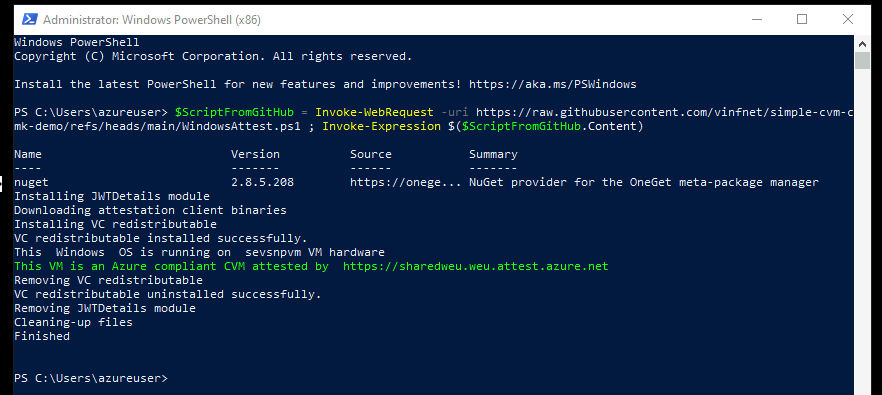

# Confidential Virtual Machines

Read more [here](https://learn.microsoft.com/en-gb/azure/confidential-computing/confidential-vm-overview) about these virtual machines that are able to protect data in use using hardware backed encryption from AMD and Intel.


# PowerShell Build Scripts

These scripts will build a sample CVM using PowerShell in a resource group with a 5-digit unique suffix (basename-abcde) and tag that resource group with owner:<YOUR_UPN>

BuildRandomCVM.ps1 will build a CVM with Customer Managed Key, Confidential Disk Encryption, a private VNet (no public IP) and deploy Azure Bastion for RDP access over the Internet. It will then kick off an attestation inside the CVM and present back the output (see WindowsAttest.ps1 for details) via Invoke-AzVMRunCommand

Use at your own risk, no warranties implied

Based on https://learn.microsoft.com/en-us/azure/confidential-computing/quick-create-confidential-vm-azure-cli and https://aka.ms/accdocs resources

Usage: 
Git clone this repo locally (subsequent script depends on WindowsAttest.ps1)
Basename is a prefix assigned to all resources created by the script and will be given a 5 char suffix - for example : myCVM-sdfrw
The script will generate a random complex password and output it to the terminal once, make sure you copy it if you want to login to the CVM

```
./BuildRandomCVM.ps1 -subsID <YOUR SUBSCRIPTION ID> -basename <YOUR BASENAME>
```
Note this will deploy an Azure Keyvault *Premium* SKU [pricing](https://azure.microsoft.com/en-gb/pricing/details/key-vault/#pricing) & enables purge protection for 10 days (you can adjust the purge protection period but AKV Premium is required for CVMs with confidential disk encryption

By default the script will create a resource in North Europe - adjust the $region parameter in the parameter block at the start for alternative regions - check availability of CVMs in that region 1st

There is a similar concept to build an AKS cluster with CMK enabled on the worker nodes.


# SQL Server on Confidential Computing

The BuildRandomSQLCVM.ps1 script builds on the CVM script but deploys the specific SQL image to give you a SQL 2022 build running on Windows Server 2022 [official docs](https://learn.microsoft.com/en-gb/azure/azure-sql/virtual-machines/windows/sql-vm-create-confidential-vm-how-to?view=azuresql)


# ARM Template
Create a simple CVM with CMK enabled (work-in-progress)

You'll need to pre-create a disk encryption set and encryption key (use Azure Keyvault Premium) and replace the relevant values in the parameter file, see 'snippet-createDES.ps1' for an automated way to do this in an existing Azure Key Vault _Premium_ instance - in future will try to do this in the ARM template itself, seems complex to get the resource ID for the DES and pass it in the same ARM template (or, at-least I haven't figured out how to do it yet)

To deploy from the command line:

New-AzResourceGroupDeployment -Name DeployLocalTemplate -ResourceGroupName "<YOUR_RESOURCE_GROUP>" -TemplateFile ./cvm-cmk.json  -TemplateParameterFile ./cvm-cmk-params.json -Verbose


# Automated Attestation

[Attestation](https://learn.microsoft.com/en-us/azure/confidential-computing/attestation-solutions) is how you prove you are running on a confidential computing VM based on evidence provided and signed by the CPU and validated by an attestation service.

Once you've deployed you can install the [simple attestation client](https://github.com/Azure/confidential-computing-cvm-guest-attestation/blob/main/cvm-platform-checker-exe/README.md) install the VC runtime 1st! to see true/false if your VM is protected by Azure Confidential Computing

The WindowsAttest.ps1 script can manually be invoked inside a CVM to do an automated attestation check against the West Europe shared attestation endpoint

Expected output:

Running on a CVM (DCa / ECa Series SKU using AMD SEV-SNP hardware)
>    This  Windows  OS is running on  sevsnpvm VM hardware
>    This VM is an Azure compliant CVM attested by  https://sharedweu.weu.attest.azure.net

NOT running on a CVM (any other Azure SKU)
>    This VM is NOT an Azure compliant CVM



You can download the script to a CVM or execute directly from GitHub >inside< your CVM by pasting the following single line Command in a PowerShell session that is running with Administrative permissions (review the script 1st to ensure you are happy with the binaries and packages it installs or download & customize)

```
$ScriptFromGitHub = Invoke-WebRequest -uri https://raw.githubusercontent.com/vinfnet/simple-cvm-cmk-demo/refs/heads/main/WindowsAttest.ps1 ; Invoke-Expression $($ScriptFromGitHub.Content)
```

If you want to run this command against your CVM >from< your own workstation over the Internet you can use the following 1-line command, edit the <VARIABLES> to match the VM you're targetting and paste it into a PowerShell session that is authenticated to your Azure subscription (in this case output will not be colour-coded)

```
$ScriptContent = Invoke-WebRequest -Uri https://raw.githubusercontent.com/vinfnet/simple-cvm-cmk-demo/main/WindowsAttest.ps1 -UseBasicParsing | Select-Object -ExpandProperty Content ; Invoke-AzVMRunCommand -ResourceGroupName <YOUR_RESOURCE_GROUP> -VMName <YOUR_VM_NAME> -CommandId "RunPowerShellScript" -ScriptString $ScriptContent
```

For more information on Azure confidential Computing see the [public docs](https//aka.ms/accdocs)


# TURBO Charged Versions

These scripts as they are useful for step by step learning or exploring, but one of our colleagues has a turbo-charged version of this script with detailed error handing, Managed HSM support and much more - check it out - [GitHub Link](https://github.com/RZomermanMS/CVM)
